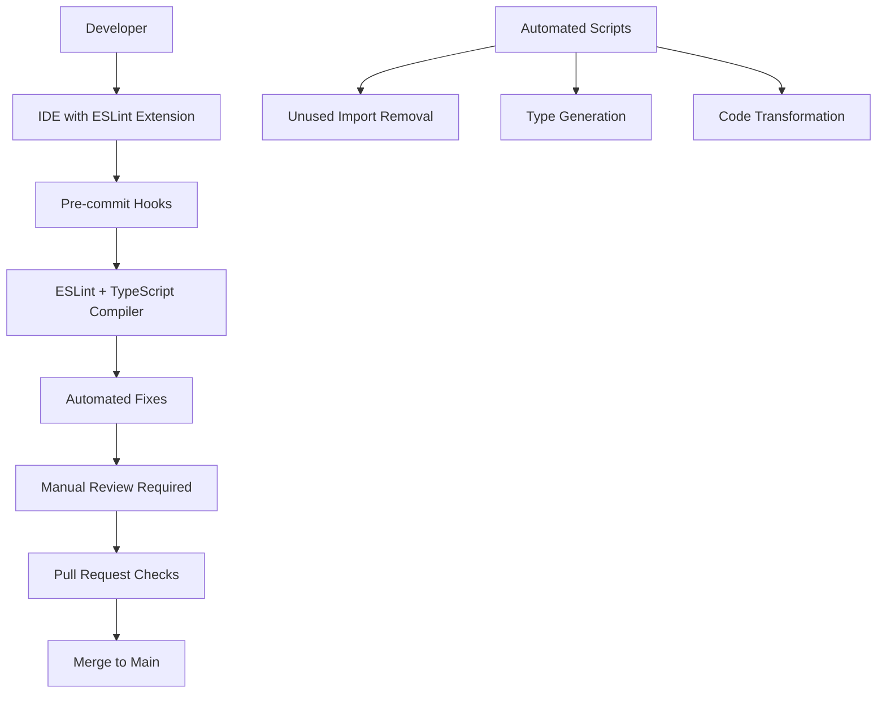

# Design Document

## Overview

This design addresses the systematic improvement of code quality and TypeScript practices in the HUNKCentral codebase. The solution involves a multi-phase approach that combines automated tooling, manual refactoring, and workflow improvements to eliminate 660+ ESLint violations and establish sustainable code quality practices.

## Architecture

### Phase-Based Improvement Strategy

The improvement will be executed in phases to minimize disruption and ensure systematic progress:

1. **Foundation Phase**: Set up tooling and automation
2. **Cleanup Phase**: Remove unused code and fix simple violations
3. **Type Safety Phase**: Replace `any` types with proper TypeScript types
4. **React Optimization Phase**: Fix React hooks and JSX issues
5. **Workflow Integration Phase**: Integrate quality checks into development workflow

### Tooling Architecture



## Components and Interfaces

### 1. ESLint Configuration Enhancement

**Purpose**: Strengthen linting rules and enable auto-fixing

**Configuration Structure**:
```typescript
interface ESLintConfig {
  extends: string[]
  parser: string
  parserOptions: {
    ecmaVersion: number
    sourceType: string
    ecmaFeatures: {
      jsx: boolean
    }
  }
  rules: {
    [ruleName: string]: 'error' | 'warn' | 'off' | [string, any]
  }
  overrides: Array<{
    files: string[]
    rules: Record<string, any>
  }>
}
```

**Key Rules to Enforce**:
- `@typescript-eslint/no-explicit-any`: error
- `@typescript-eslint/no-unused-vars`: error
- `react-hooks/exhaustive-deps`: error
- `react/no-unescaped-entities`: error

### 2. TypeScript Type System Improvements

**Purpose**: Replace `any` types with proper interfaces and types

**Type Categories to Address**:

```typescript
// API Response Types
interface ApiResponse<T> {
  data: T
  success: boolean
  error?: string
}

// Error Types
interface AppError {
  code: string
  message: string
  details?: Record<string, any>
}

// Mock Types for Testing
type MockedFunction<T extends (...args: any[]) => any> = jest.MockedFunction<T>

// Prisma Query Types
type PrismaUser = Prisma.UserGetPayload<{
  include: { roles: true }
}>
```

### 3. Automated Code Transformation Tools

**Purpose**: Automate repetitive fixes and transformations

**Tool Categories**:

1. **Unused Import Remover**
   - Scans files for unused imports
   - Removes unused imports automatically
   - Preserves type-only imports where needed

2. **Type Generator**
   - Analyzes `any` usage patterns
   - Generates proper TypeScript interfaces
   - Suggests type replacements

3. **React Hook Dependency Fixer**
   - Analyzes useEffect, useCallback, useMemo hooks
   - Adds missing dependencies
   - Suggests refactoring for complex dependencies

### 4. Pre-commit Hook System

**Purpose**: Prevent quality issues from entering the repository

**Hook Sequence**:
```bash
#!/bin/sh
# Pre-commit hook sequence
npm run lint:fix          # Auto-fix what can be fixed
npm run type-check        # Ensure TypeScript compilation
npm run test:types        # Run type-only tests
npm run unused-imports    # Remove unused imports
```

## Data Models

### Code Quality Metrics

```typescript
interface CodeQualityMetrics {
  totalFiles: number
  eslintViolations: {
    errors: number
    warnings: number
    byRule: Record<string, number>
  }
  typeScriptIssues: {
    anyTypes: number
    missingTypes: number
    compilationErrors: number
  }
  testCoverage: {
    statements: number
    branches: number
    functions: number
    lines: number
  }
}
```

### Refactoring Progress Tracking

```typescript
interface RefactoringProgress {
  phase: 'foundation' | 'cleanup' | 'types' | 'react' | 'workflow'
  completedTasks: string[]
  remainingTasks: string[]
  filesModified: string[]
  metricsImprovement: {
    before: CodeQualityMetrics
    after: CodeQualityMetrics
  }
}
```

## Error Handling

### Graceful Degradation Strategy

1. **Non-breaking Changes First**: Start with fixes that don't change functionality
2. **Incremental Type Improvements**: Replace `any` types gradually
3. **Fallback Mechanisms**: Maintain backward compatibility during transition
4. **Rollback Procedures**: Clear rollback steps for each phase

### Error Categories and Handling

```typescript
enum RefactoringErrorType {
  COMPILATION_ERROR = 'compilation_error',
  BREAKING_CHANGE = 'breaking_change',
  TEST_FAILURE = 'test_failure',
  DEPENDENCY_CONFLICT = 'dependency_conflict'
}

interface RefactoringError {
  type: RefactoringErrorType
  file: string
  line?: number
  message: string
  suggestedFix?: string
  canAutoFix: boolean
}
```

## Testing Strategy

### Multi-Level Testing Approach

1. **Unit Tests for Utilities**
   - Test automated transformation tools
   - Verify type generation accuracy
   - Test ESLint rule configurations

2. **Integration Tests for Workflow**
   - Test pre-commit hook execution
   - Verify CI/CD pipeline integration
   - Test IDE integration

3. **Regression Tests**
   - Ensure existing functionality remains intact
   - Test that fixes don't introduce new issues
   - Verify performance improvements

### Test Data and Scenarios

```typescript
interface TestScenario {
  name: string
  inputCode: string
  expectedOutput: string
  transformationType: 'unused-imports' | 'type-replacement' | 'hook-deps'
  shouldAutoFix: boolean
}
```

## Implementation Phases

### Phase 1: Foundation (Days 1-2)
- Set up enhanced ESLint configuration
- Install and configure pre-commit hooks
- Create automated transformation scripts
- Set up CI/CD quality gates

### Phase 2: Cleanup (Days 3-4)
- Remove unused imports across codebase
- Remove unused variables and functions
- Fix unescaped JSX entities
- Clean up require() imports

### Phase 3: Type Safety (Days 5-7)
- Create proper interfaces for API responses
- Replace `any` types in business logic
- Add proper error type definitions
- Update test mocks with proper typing

### Phase 4: React Optimization (Days 8-9)
- Fix React hook dependencies
- Optimize component re-renders
- Improve prop type definitions
- Clean up component interfaces

### Phase 5: Workflow Integration (Day 10)
- Integrate quality checks into development workflow
- Update documentation and guidelines
- Train team on new practices
- Monitor and adjust rules based on feedback

## Performance Considerations

### Build Time Optimization
- Incremental TypeScript compilation
- Parallel ESLint execution
- Cached transformation results
- Optimized pre-commit hook execution

### Runtime Performance
- Reduced bundle sizes from unused code removal
- Better tree-shaking from proper imports
- Improved TypeScript compilation speed
- Faster development builds

## Security Considerations

### Code Quality as Security
- Proper typing prevents runtime errors
- Unused code removal reduces attack surface
- Better error handling prevents information leakage
- Consistent patterns reduce security bugs

### Safe Transformation Process
- Version control for all changes
- Automated backup before transformations
- Rollback procedures for each phase
- Code review requirements for critical changes

## Monitoring and Metrics

### Quality Metrics Dashboard

```typescript
interface QualityDashboard {
  currentMetrics: CodeQualityMetrics
  historicalTrend: Array<{
    date: string
    metrics: CodeQualityMetrics
  }>
  phaseProgress: RefactoringProgress
  teamAdoption: {
    developersUsingTools: number
    averageViolationsPerPR: number
    autoFixSuccessRate: number
  }
}
```

### Success Criteria
- Zero ESLint errors in production code
- Less than 10 ESLint warnings total
- 95%+ TypeScript strict mode compliance
- Sub-30-second pre-commit hook execution
- 90%+ developer satisfaction with tooling

## Migration Strategy

### Backward Compatibility
- Maintain existing API contracts
- Preserve component interfaces
- Keep test interfaces stable
- Gradual rollout of strict rules

### Team Training and Adoption
- Documentation updates
- Code review guidelines
- IDE setup instructions
- Best practices examples

### Risk Mitigation
- Feature flags for new quality rules
- Gradual enforcement timeline
- Clear rollback procedures
- Comprehensive testing at each phase