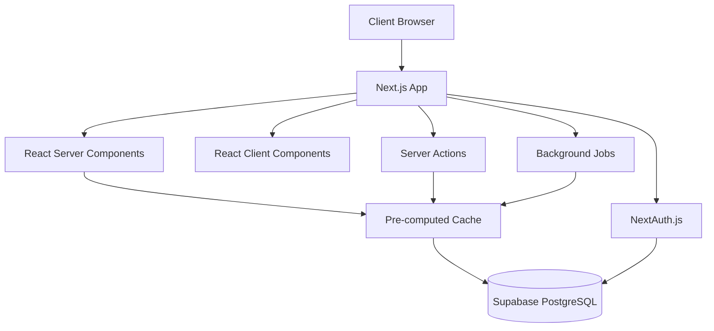
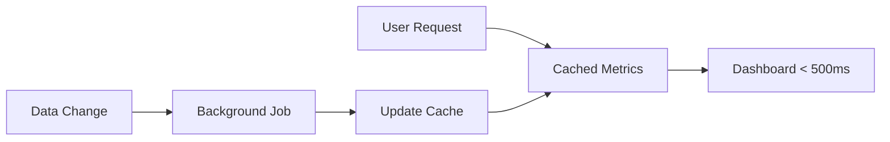

# HUNKCentral Complete Rebuild - Design Document

## Overview

This document outlines the technical design and architecture for the complete rebuild of HUNKCentral, a digital workforce management system for College Hunks Hauling Junk & Moving. The design focuses on performance optimization, modern UI components, and role-specific user experiences while addressing all current system limitations.

The system will be built using Next.js 15 with App Router, shadcn/ui blocks (New York theme), and Tailwind CSS v4, emphasizing pre-computed metrics, optimized database queries, and smooth user interactions.

## Architecture

### Technical Stack

- **Framework**: Next.js 15 (App Router) with TypeScript strict mode
- **UI Library**: Shadcn/ui (New York theme) with blocks-first approach
- **Styling**: Tailwind CSS v4 with College Hunks brand colors (#026937, #ea7200)
- **Theme System**: Light/Dark/System theme support with persistent user preference
- **Database**: Supabase-hosted PostgreSQL with Prisma ORM
- **Forms**: React Hook Form + Zod validation (mandatory for all forms)
- **State**: Zustand (minimal usage, prefer server state)
- **Authentication**: NextAuth.js with credentials provider
- **Deployment**: Vercel
- **Performance**: Pre-computed metrics with background job processing

### System Architecture

The application follows a performance-optimized Next.js architecture:

1. **Server Components**: For data-heavy pages with pre-computed metrics
2. **Client Components**: Only for interactive UI elements
3. **Server Actions**: For form submissions and data mutations
4. **Background Jobs**: For heavy calculations and metric pre-computation
5. **Optimized Queries**: Single queries with joins instead of sequential queries



### Performance Architecture



## Components and Interfaces

### Core Application Structure

```
/app
  /auth                → Login using login-02 block
  /(protected)
    /dashboard         → Role-specific dashboards using dashboard-01 block
    /logs              → Log creation, review, detail pages
      /create          → Captain log creation form
      /[id]            → Individual log detail view
      /review          → Manager review interface
    /commission        → Commission entry and tracking
      /create          → Sales commission entry form
      /list            → Commission status tracking
    /reports           → Payroll and compensation reports
      /payroll         → Administrative payroll reports
      /my-payroll      → Employee self-service view
    /admin             → Administrative functions
      /users           → User management interface
      /pay-periods     → Pay period management

/components
  /ui                  → Shadcn/ui base components
  /blocks              → Shadcn/ui blocks (dashboard-01, login-02, sidebar-07)
  /features            → Feature-specific components
    /logs              → Log-related components
    /commission        → Commission components
    /reports           → Report components
    /auth              → Authentication components
  /layout              → Layout and navigation components

/lib
  /auth.ts             → Authentication utilities
  /prisma.ts           → Prisma client with optimized queries
  /payCalculator.ts    → Pre-computed payroll calculations
  /commissionMatcher.ts → Commission matching algorithms
  /backgroundJobs.ts   → Background job processing
  /cache.ts            → Cache management utilities
  /validations.ts      → Zod schemas for form validation
```

### Shadcn/UI Block Implementation

#### Dashboard Layout (dashboard-01 block)

The dashboard-01 block provides the perfect foundation for role-specific dashboards with:

- **Modern Card Layouts**: Using SectionCards component for metrics display
- **Interactive Charts**: ChartAreaInteractive for performance visualization
- **Data Tables**: Advanced DataTable with sorting, filtering, and pagination
- **Sidebar Navigation**: AppSidebar with role-based menu items
- **Responsive Design**: Container queries and mobile optimization

**Role-Specific Dashboard Adaptations:**

```typescript
// Captain Dashboard using dashboard-01 components
const CaptainDashboard = () => {
  return (
    <div className="@container/main flex flex-1 flex-col gap-2">
      <div className="flex flex-col gap-4 py-4 md:gap-6 md:py-6">
        <CaptainMetricsCards /> // Adapted SectionCards
        <div className="px-4 lg:px-6">
          <LaborCostChart /> // Adapted ChartAreaInteractive
        </div>
        <LogHistoryTable /> // Adapted DataTable
      </div>
    </div>
  )
}
```

#### Authentication (login-02 block)

The login-02 block provides a clean, modern authentication interface:

- **Split Layout**: Professional left panel with branded right panel
- **LoginForm Component**: Clean form with validation
- **Brand Integration**: College Hunks logo and colors
- **Mobile Responsive**: Optimized for all screen sizes

#### Navigation (sidebar-07 block)

The sidebar-07 block offers advanced navigation features:

- **Collapsible Sidebar**: Icon mode for space efficiency
- **Team Switcher**: Adapted for location/franchise switching
- **Hierarchical Navigation**: Main nav with sub-items
- **User Profile Menu**: Comprehensive user actions
- **Mobile Adaptation**: Responsive behavior

## Universal Data Table & Chart Standards

### Comprehensive Search, Sort, and Filter Requirements

All data displays (tables, charts, reports, payroll views) must implement the following standardized functionality:

```typescript
// Universal DataTable component with full functionality
interface UniversalDataTableProps<T> {
  data: T[]
  columns: ColumnDef<T>[]
  
  // Search functionality
  searchable?: boolean
  searchPlaceholder?: string
  globalSearch?: boolean
  columnSearch?: boolean
  
  // Sorting functionality
  sortable?: boolean
  defaultSort?: { column: string; direction: 'asc' | 'desc' }
  multiSort?: boolean
  
  // Filtering functionality
  filters?: FilterConfig[]
  quickFilters?: QuickFilterConfig[]
  advancedFilters?: boolean
  
  // Grouping and aggregation
  groupBy?: GroupByConfig[]
  aggregations?: AggregationConfig[]
  
  // Export functionality
  exportOptions?: ('excel' | 'csv' | 'pdf' | 'print')[]
  
  // Pagination
  pagination?: boolean
  pageSize?: number
  pageSizeOptions?: number[]
  
  // Actions
  actions?: ActionConfig[]
  bulkActions?: BulkActionConfig[]
  rowActions?: RowActionConfig[]
}

// Filter configuration types
interface FilterConfig {
  key: string
  label: string
  type: 'select' | 'multiSelect' | 'dateRange' | 'numberRange' | 'text' | 'boolean'
  options?: { value: string; label: string }[]
  placeholder?: string
}

interface QuickFilterConfig {
  key: string
  label: string
  value: any
  icon?: React.ComponentType
}

// Chart filtering and interaction
interface UniversalChartProps {
  data: any[]
  type: 'line' | 'bar' | 'area' | 'pie' | 'scatter'
  
  // Interactive features
  interactive?: boolean
  zoomable?: boolean
  brushable?: boolean
  
  // Filtering
  dateRangeFilter?: boolean
  categoryFilter?: boolean
  valueFilter?: boolean
  
  // Export
  exportOptions?: ('png' | 'svg' | 'pdf')[]
  
  // Drill-down capability
  drillDown?: boolean
  onDrillDown?: (data: any) => void
}
```

### Standardized Filter Implementation

```typescript
// All tables must implement these standard filters where applicable
const STANDARD_FILTERS = {
  // Date filters
  dateRange: {
    type: 'dateRange',
    presets: [
      { label: 'Today', value: 'today' },
      { label: 'Yesterday', value: 'yesterday' },
      { label: 'Last 7 days', value: 'last7days' },
      { label: 'Last 30 days', value: 'last30days' },
      { label: 'This month', value: 'thisMonth' },
      { label: 'Last month', value: 'lastMonth' },
      { label: 'Current pay period', value: 'currentPayPeriod' },
      { label: 'Previous pay period', value: 'previousPayPeriod' },
      { label: 'Custom range', value: 'custom' }
    ]
  },
  
  // Status filters
  status: {
    type: 'multiSelect',
    options: [
      { value: 'active', label: 'Active', color: 'green' },
      { value: 'pending', label: 'Pending', color: 'yellow' },
      { value: 'approved', label: 'Approved', color: 'blue' },
      { value: 'rejected', label: 'Rejected', color: 'red' },
      { value: 'draft', label: 'Draft', color: 'gray' }
    ]
  },
  
  // Role filters
  role: {
    type: 'multiSelect',
    options: [
      { value: 'admin', label: 'Administrator' },
      { value: 'manager', label: 'Manager' },
      { value: 'captain', label: 'Captain' },
      { value: 'wingman', label: 'Wingman' },
      { value: 'sales', label: 'Sales Consultant' }
    ]
  },
  
  // Amount ranges
  amountRange: {
    type: 'numberRange',
    presets: [
      { label: 'Under $100', value: { max: 100 } },
      { label: '$100 - $500', value: { min: 100, max: 500 } },
      { label: '$500 - $1,000', value: { min: 500, max: 1000 } },
      { label: '$1,000 - $5,000', value: { min: 1000, max: 5000 } },
      { label: 'Over $5,000', value: { min: 5000 } }
    ]
  }
}

// Quick filter buttons for common actions
const QUICK_FILTERS = {
  logs: [
    { key: 'pending', label: 'Pending Approval', icon: IconClock },
    { key: 'today', label: 'Today', icon: IconCalendar },
    { key: 'myLogs', label: 'My Logs', icon: IconUser },
    { key: 'highRevenue', label: 'High Revenue', icon: IconTrendingUp }
  ],
  payroll: [
    { key: 'currentPeriod', label: 'Current Period', icon: IconCalendar },
    { key: 'needsReview', label: 'Needs Review', icon: IconAlertCircle },
    { key: 'highEarners', label: 'Top Earners', icon: IconTrendingUp },
    { key: 'newEmployees', label: 'New Employees', icon: IconUserPlus }
  ],
  commission: [
    { key: 'pending', label: 'Pending Match', icon: IconClock },
    { key: 'matched', label: 'Matched', icon: IconCheck },
    { key: 'thisWeek', label: 'This Week', icon: IconCalendar },
    { key: 'highValue', label: 'High Value', icon: IconDollarSign }
  ]
}
```

### Key Component Implementations

#### Role-Specific Dashboard Components

**Captain Dashboard Components:**
```typescript
// Using dashboard-01 SectionCards pattern with branded styling
const CaptainMetricsCards = () => {
  const metrics = useCaptainMetrics() // Pre-computed data
  
  return (
    <div className="grid grid-cols-1 gap-4 px-4 lg:px-6 @xl/main:grid-cols-2 @5xl/main:grid-cols-4">
      <BrandedMetricCard
        title="Total Jobs"
        value={metrics.totalJobs}
        trend={metrics.jobsTrend}
        icon={<IconBriefcase />}
        type="performance"
      />
      <BrandedMetricCard
        title="Labor Cost %"
        value={`${metrics.laborCostPercent}%`}
        trend={metrics.laborTrend}
        target="14% Junk, 24% Move"
        type="efficiency"
      />
      <BrandedMetricCard
        title="Total Tips"
        value={formatCurrency(metrics.totalTips)}
        trend={metrics.tipsTrend}
        type="revenue"
      />
      <BrandedMetricCard
        title="Labor Bonus"
        value={formatCurrency(metrics.laborBonus)}
        trend={metrics.bonusTrend}
        type="revenue"
      />
    </div>
  )
}

// Interactive labor cost chart with comprehensive filtering
const LaborCostChart = () => {
  const [filters, setFilters] = useState({
    dateRange: 'currentPayPeriod',
    jobType: 'all',
    department: 'all'
  })
  
  return (
    <Card className="hunk-gradient-bg">
      <CardHeader>
        <div className="flex justify-between items-center">
          <div>
            <CardTitle className="text-primary">Labor Cost Trends</CardTitle>
            <CardDescription>Track your efficiency over time</CardDescription>
          </div>
          <div className="flex gap-2">
            <Select value={filters.dateRange} onValueChange={(value) => setFilters({...filters, dateRange: value})}>
              <SelectTrigger className="w-40">
                <SelectValue />
              </SelectTrigger>
              <SelectContent>
                <SelectItem value="last7days">Last 7 Days</SelectItem>
                <SelectItem value="last30days">Last 30 Days</SelectItem>
                <SelectItem value="currentPayPeriod">Current Period</SelectItem>
                <SelectItem value="lastPayPeriod">Last Period</SelectItem>
              </SelectContent>
            </Select>
            <Select value={filters.jobType} onValueChange={(value) => setFilters({...filters, jobType: value})}>
              <SelectTrigger className="w-32">
                <SelectValue />
              </SelectTrigger>
              <SelectContent>
                <SelectItem value="all">All Jobs</SelectItem>
                <SelectItem value="junk">Junk Only</SelectItem>
                <SelectItem value="move">Move Only</SelectItem>
              </SelectContent>
            </Select>
            <Button variant="outline" size="sm">
              <IconDownload className="w-4 h-4 mr-2" />
              Export
            </Button>
          </div>
        </div>
      </CardHeader>
      <CardContent>
        <ChartContainer config={laborCostChartConfig}>
          <AreaChart data={filteredData}>
            <defs>
              <linearGradient id="laborCostGradient" x1="0" y1="0" x2="0" y2="1">
                <stop offset="5%" stopColor="var(--primary)" stopOpacity={0.8} />
                <stop offset="95%" stopColor="var(--primary)" stopOpacity={0.1} />
              </linearGradient>
            </defs>
            <CartesianGrid strokeDasharray="3 3" />
            <XAxis dataKey="date" />
            <YAxis />
            <ChartTooltip content={<ChartTooltipContent />} />
            <Area
              type="monotone"
              dataKey="laborCostPercent"
              stroke="var(--primary)"
              fillOpacity={1}
              fill="url(#laborCostGradient)"
            />
            <ReferenceLine y={14} stroke="var(--secondary)" strokeDasharray="5 5" label="Junk Goal" />
            <ReferenceLine y={24} stroke="var(--secondary)" strokeDasharray="5 5" label="Move Goal" />
          </AreaChart>
        </ChartContainer>
      </CardContent>
    </Card>
  )
}
```

**Manager Dashboard Components:**
```typescript
// Using dashboard-01 DataTable pattern with comprehensive filtering
const PendingLogsTable = () => {
  const pendingLogs = usePendingLogs() // Pre-computed data
  
  return (
    <DataTable
      data={pendingLogs}
      columns={managerReviewColumns}
      searchable={true}
      searchPlaceholder="Search by captain, job ID, or client..."
      sortable={true}
      defaultSort={{ column: 'submittedAt', direction: 'desc' }}
      filters={[
        { key: 'status', label: 'Status', options: ['submitted', 'in_review', 'needs_changes'] },
        { key: 'captain', label: 'Captain', type: 'select' },
        { key: 'logDate', label: 'Date Range', type: 'dateRange' },
        { key: 'totalRevenue', label: 'Revenue Range', type: 'numberRange' },
        { key: 'laborCostPercent', label: 'Labor Cost %', type: 'numberRange' }
      ]}
      actions={bulkApprovalActions}
      exportOptions={['excel', 'csv', 'pdf']}
      pagination={true}
      pageSize={25}
    />
  )
}
```

#### Optimized Log Creation Form

```typescript
// Using React Hook Form + Zod (mandatory)
const LogCreationForm = () => {
  const form = useForm<LogFormData>({
    resolver: zodResolver(logFormSchema),
    defaultValues: {
      captainId: currentUser.id, // Pre-populated
      logDate: new Date(),
      sections: {
        junk: { jobs: [], hours: [] },
        move: { jobs: [], hours: [] },
        other: { hours: [] }
      }
    }
  })

  return (
    <Form {...form}>
      <div className="space-y-6">
        <DateRangePicker /> // Pay period selector
        <LogSectionTabs /> // Junk, Move, Other Hours
        <RealTimeCalculations /> // Live updates
        <SubmitButton />
      </div>
    </Form>
  )
}
```

#### Commission Tracking Interface

```typescript
// Clean, simple form with auto-matching
const CommissionEntryForm = () => {
  const form = useForm<CommissionFormData>({
    resolver: zodResolver(commissionFormSchema)
  })

  return (
    <Card>
      <CardHeader>
        <CardTitle>Create Commission Entry</CardTitle>
      </CardHeader>
      <CardContent>
        <Form {...form}>
          <div className="grid gap-4">
            <FormField name="jobId" render={JobIdInput} />
            <FormField name="clientName" render={ClientNameInput} />
            <FormField name="estimatedAmount" render={CurrencyInput} />
            <FormField name="targetDate" render={DatePicker} />
          </div>
        </Form>
      </CardContent>
    </Card>
  )
}
```

#### Admin Management Interface

```typescript
// Comprehensive user management with granular permissions
const UserManagementInterface = () => {
  return (
    <div className="space-y-6">
      <div className="flex justify-between items-center">
        <h1 className="text-2xl font-bold">User Management</h1>
        <div className="flex gap-2">
          <Button onClick={() => setShowBulkImport(true)}>
            <IconUpload /> Bulk Import
          </Button>
          <Button onClick={() => setShowCreateUser(true)}>
            <IconPlus /> Add User
          </Button>
        </div>
      </div>

      <UserFilters />
      <UserDataTable />
      <UserPermissionDialog />
      <BulkOperationsPanel />
    </div>
  )
}

// Granular permission system
const UserPermissionDialog = ({ user }: { user: User }) => {
  const permissions = useUserPermissions(user.id)
  
  return (
    <Dialog>
      <DialogContent className="max-w-4xl">
        <DialogHeader>
          <DialogTitle>Manage Permissions - {user.fullName}</DialogTitle>
        </DialogHeader>
        
        <Tabs defaultValue="roles">
          <TabsList>
            <TabsTrigger value="roles">Roles & Access</TabsTrigger>
            <TabsTrigger value="compensation">Compensation</TabsTrigger>
            <TabsTrigger value="permissions">Granular Permissions</TabsTrigger>
            <TabsTrigger value="locations">Location Access</TabsTrigger>
          </TabsList>
          
          <TabsContent value="roles">
            <RoleAssignmentPanel user={user} />
          </TabsContent>
          
          <TabsContent value="compensation">
            <CompensationSettingsPanel user={user} />
          </TabsContent>
          
          <TabsContent value="permissions">
            <GranularPermissionsPanel user={user} />
          </TabsContent>
          
          <TabsContent value="locations">
            <LocationAccessPanel user={user} />
          </TabsContent>
        </Tabs>
      </DialogContent>
    </Dialog>
  )
}

// Granular permissions panel
const GranularPermissionsPanel = ({ user }: { user: User }) => {
  const permissionGroups = [
    {
      name: "Dashboard Access",
      permissions: [
        { key: "view_own_dashboard", label: "View Own Dashboard", default: true },
        { key: "view_team_dashboard", label: "View Team Dashboard", roles: ["manager", "admin"] },
        { key: "view_all_dashboards", label: "View All Dashboards", roles: ["admin"] }
      ]
    },
    {
      name: "Log Management",
      permissions: [
        { key: "create_logs", label: "Create Daily Logs", roles: ["captain"] },
        { key: "edit_own_logs", label: "Edit Own Logs", default: true },
        { key: "edit_team_logs", label: "Edit Team Logs", roles: ["manager", "admin"] },
        { key: "approve_logs", label: "Approve Logs", roles: ["manager", "admin"] },
        { key: "delete_logs", label: "Delete Logs", roles: ["admin"] }
      ]
    },
    {
      name: "Commission Management",
      permissions: [
        { key: "create_commissions", label: "Create Commission Entries", roles: ["sales", "admin"] },
        { key: "view_own_commissions", label: "View Own Commissions", default: true },
        { key: "view_all_commissions", label: "View All Commissions", roles: ["manager", "admin"] },
        { key: "edit_commissions", label: "Edit Commission Entries", roles: ["admin"] }
      ]
    },
    {
      name: "Payroll & Reports",
      permissions: [
        { key: "view_own_payroll", label: "View Own Payroll", default: true },
        { key: "view_team_payroll", label: "View Team Payroll", roles: ["manager", "admin"] },
        { key: "generate_reports", label: "Generate Reports", roles: ["manager", "admin"] },
        { key: "export_payroll", label: "Export Payroll Data", roles: ["admin"] }
      ]
    },
    {
      name: "User Management",
      permissions: [
        { key: "view_users", label: "View User List", roles: ["manager", "admin"] },
        { key: "create_users", label: "Create Users", roles: ["admin"] },
        { key: "edit_users", label: "Edit Users", roles: ["admin"] },
        { key: "manage_permissions", label: "Manage Permissions", roles: ["admin"] }
      ]
    },
    {
      name: "System Administration",
      permissions: [
        { key: "manage_pay_periods", label: "Manage Pay Periods", roles: ["admin"] },
        { key: "view_audit_logs", label: "View Audit Logs", roles: ["manager", "admin"] },
        { key: "system_settings", label: "System Settings", roles: ["admin"] }
      ]
    }
  ]

  return (
    <div className="space-y-6">
      {permissionGroups.map(group => (
        <Card key={group.name}>
          <CardHeader>
            <CardTitle className="text-lg">{group.name}</CardTitle>
          </CardHeader>
          <CardContent>
            <div className="grid gap-3">
              {group.permissions.map(permission => (
                <div key={permission.key} className="flex items-center justify-between">
                  <div className="flex items-center space-x-2">
                    <Checkbox
                      id={permission.key}
                      checked={user.permissions?.includes(permission.key)}
                      disabled={!canGrantPermission(permission, user)}
                    />
                    <Label htmlFor={permission.key}>{permission.label}</Label>
                  </div>
                  {permission.roles && (
                    <Badge variant="outline">
                      {permission.roles.join(", ")}
                    </Badge>
                  )}
                </div>
              ))}
            </div>
          </CardContent>
        </Card>
      ))}
    </div>
  )
}
```

#### Role-Specific Reports Interface

```typescript
// Dynamic report interface based on user permissions
const ReportsInterface = () => {
  const { user } = useSession()
  const availableReports = useAvailableReports(user)
  
  return (
    <div className="space-y-6">
      <div className="flex justify-between items-center">
        <h1 className="text-2xl font-bold">Reports & Analytics</h1>
        <DateRangeSelector />
      </div>

      <Tabs defaultValue="my-payroll">
        <TabsList>
          {availableReports.map(report => (
            <TabsTrigger key={report.key} value={report.key}>
              {report.title}
              {report.requiresPermission && (
                <Badge variant="secondary" className="ml-2">
                  {report.requiredRole}
                </Badge>
              )}
            </TabsTrigger>
          ))}
        </TabsList>

        <TabsContent value="my-payroll">
          <MyPayrollReport />
        </TabsContent>

        <TabsContent value="team-payroll">
          <TeamPayrollReport />
        </TabsContent>

        <TabsContent value="commission-reports">
          <CommissionReports />
        </TabsContent>

        <TabsContent value="labor-analytics">
          <LaborAnalyticsReport />
        </TabsContent>

        <TabsContent value="admin-reports">
          <AdminReports />
        </TabsContent>
      </Tabs>
    </div>
  )
}

// My Payroll - Available to all users with comprehensive filtering
const MyPayrollReport = () => {
  const { user } = useSession()
  const payrollData = useMyPayroll(user.id)
  
  return (
    <div className="space-y-6">
      <Card>
        <CardHeader>
          <CardTitle>My Compensation Breakdown</CardTitle>
          <CardDescription>
            Your earnings for the selected pay period
          </CardDescription>
        </CardHeader>
        <CardContent>
          <div className="grid gap-4 md:grid-cols-2 lg:grid-cols-4">
            <MetricCard
              title="Base Hours"
              value={`${payrollData.totalHours} hrs`}
              subtitle={`$${payrollData.hourlyEarnings}`}
            />
            <MetricCard
              title="Tips Earned"
              value={formatCurrency(payrollData.totalTips)}
              subtitle={`${payrollData.tipsCount} distributions`}
            />
            <MetricCard
              title="Labor Bonus"
              value={formatCurrency(payrollData.laborBonus)}
              subtitle={`${payrollData.bonusJobs} qualifying jobs`}
            />
            <MetricCard
              title="Commission"
              value={formatCurrency(payrollData.commission)}
              subtitle={`${payrollData.commissionJobs} jobs`}
            />
          </div>
          
          <Separator className="my-6" />
          
          <div className="space-y-4">
            <div className="flex justify-between items-center">
              <h3 className="text-lg font-semibold">Detailed Breakdown</h3>
              <div className="flex gap-2">
                <Input
                  placeholder="Search entries..."
                  className="w-64"
                />
                <Select>
                  <SelectTrigger className="w-40">
                    <SelectValue placeholder="Filter by type" />
                  </SelectTrigger>
                  <SelectContent>
                    <SelectItem value="all">All Types</SelectItem>
                    <SelectItem value="hours">Hours</SelectItem>
                    <SelectItem value="tips">Tips</SelectItem>
                    <SelectItem value="bonus">Bonus</SelectItem>
                    <SelectItem value="commission">Commission</SelectItem>
                  </SelectContent>
                </Select>
                <Button variant="outline" size="sm">
                  <IconDownload className="w-4 h-4 mr-2" />
                  Export
                </Button>
              </div>
            </div>
            <PayrollBreakdownTable 
              data={payrollData.breakdown}
              searchable={true}
              sortable={true}
              filters={[
                { key: 'type', label: 'Type' },
                { key: 'date', label: 'Date Range', type: 'dateRange' },
                { key: 'amount', label: 'Amount Range', type: 'numberRange' }
              ]}
              exportOptions={['excel', 'csv', 'pdf']}
            />
          </div>
        </CardContent>
      </Card>
    </div>
  )
}

// Team Payroll - Available to managers and admins with advanced filtering
const TeamPayrollReport = () => {
  const teamPayroll = useTeamPayroll()
  
  return (
    <div className="space-y-6">
      <Card>
        <CardHeader>
          <CardTitle>Team Payroll Summary</CardTitle>
          <CardDescription>
            Payroll overview for your team members
          </CardDescription>
        </CardHeader>
        <CardContent>
          <DataTable
            data={teamPayroll}
            columns={teamPayrollColumns}
            searchable={true}
            searchPlaceholder="Search by name, role, or department..."
            sortable={true}
            defaultSort={{ column: 'totalEarnings', direction: 'desc' }}
            filters={[
              { key: "role", label: "Role", options: ['captain', 'wingman', 'manager', 'sales'] },
              { key: "department", label: "Department", options: ['junk', 'move', 'sales', 'admin'] },
              { key: "status", label: "Status", options: ['active', 'inactive', 'pending'] },
              { key: "location", label: "Location", type: 'select' },
              { key: "hireDate", label: "Hire Date", type: 'dateRange' },
              { key: "totalEarnings", label: "Earnings Range", type: 'numberRange' },
              { key: "hoursWorked", label: "Hours Range", type: 'numberRange' }
            ]}
            groupBy={[
              { key: "department", label: "Group by Department" },
              { key: "role", label: "Group by Role" },
              { key: "location", label: "Group by Location" }
            ]}
            actions={[
              { label: "Export to Excel", action: exportToExcel },
              { label: "Generate ADP File", action: generateADP },
              { label: "Print Summary", action: printSummary },
              { label: "Email Report", action: emailReport }
            ]}
            bulkActions={[
              { label: "Approve Selected", action: bulkApprove },
              { label: "Export Selected", action: bulkExport }
            ]}
            pagination={true}
            pageSize={50}
          />
        </CardContent>
      </Card>
    </div>
  )
}

// Admin Reports - Available to admins only
const AdminReports = () => {
  return (
    <div className="space-y-6">
      <div className="grid gap-4 md:grid-cols-2 lg:grid-cols-3">
        <ReportCard
          title="System Performance"
          description="Dashboard load times, query performance"
          icon={<IconActivity />}
          onClick={() => openReport('system-performance')}
        />
        <ReportCard
          title="User Activity"
          description="Login frequency, feature usage"
          icon={<IconUsers />}
          onClick={() => openReport('user-activity')}
        />
        <ReportCard
          title="Data Integrity"
          description="Missing logs, calculation errors"
          icon={<IconShield />}
          onClick={() => openReport('data-integrity')}
        />
        <ReportCard
          title="Audit Trail"
          description="All system changes and approvals"
          icon={<IconFileText />}
          onClick={() => openReport('audit-trail')}
        />
        <ReportCard
          title="Business Analytics"
          description="Revenue trends, efficiency metrics"
          icon={<IconTrendingUp />}
          onClick={() => openReport('business-analytics')}
        />
        <ReportCard
          title="Compliance Reports"
          description="Payroll compliance, labor law adherence"
          icon={<IconClipboardCheck />}
          onClick={() => openReport('compliance')}
        />
      </div>
    </div>
  )
}
```

### UI Design System

#### Brand Integration & Visual Identity with Theme Support

```css
/* Tailwind CSS v4 Custom Colors - Light Theme */
:root {
  --primary: #026937; /* College Hunks Green */
  --secondary: #ea7200; /* College Hunks Orange */
  --primary-light: #028a4a;
  --primary-dark: #014d28;
  --secondary-light: #ff8c1a;
  --secondary-dark: #cc5f00;
  
  /* Light theme specific */
  --background: #ffffff;
  --foreground: #0a0a0a;
  --card: #ffffff;
  --card-foreground: #0a0a0a;
  --muted: #f1f5f9;
  --muted-foreground: #64748b;
  --border: #e2e8f0;
}

/* Dark Theme */
[data-theme="dark"] {
  --primary: #028a4a; /* Slightly lighter green for dark mode */
  --secondary: #ff8c1a; /* Slightly lighter orange for dark mode */
  --primary-light: #02a855;
  --primary-dark: #014d28;
  --secondary-light: #ffa533;
  --secondary-dark: #cc5f00;
  
  /* Dark theme specific */
  --background: #0a0a0a;
  --foreground: #fafafa;
  --card: #1a1a1a;
  --card-foreground: #fafafa;
  --muted: #262626;
  --muted-foreground: #a1a1aa;
  --border: #404040;
}

/* System theme detection */
@media (prefers-color-scheme: dark) {
  :root:not([data-theme]) {
    --primary: #028a4a;
    --secondary: #ff8c1a;
    --background: #0a0a0a;
    --foreground: #fafafa;
    --card: #1a1a1a;
    --card-foreground: #fafafa;
    --muted: #262626;
    --muted-foreground: #a1a1aa;
    --border: #404040;
  }
}

/* Component Customizations - Theme Aware */
.dashboard-card {
  @apply bg-gradient-to-t from-primary/5 to-card shadow-xs border-l-4 border-l-primary/20;
  @apply dark:from-primary/10 dark:to-card dark:border-l-primary/30;
}

.metric-trend-up {
  @apply text-primary dark:text-primary-light;
}

.metric-trend-down {
  @apply text-secondary dark:text-secondary-light;
}

.hunk-button-primary {
  @apply bg-primary hover:bg-primary-dark text-white font-semibold;
  @apply dark:bg-primary-light dark:hover:bg-primary;
}

.hunk-button-secondary {
  @apply bg-secondary hover:bg-secondary-dark text-white font-semibold;
  @apply dark:bg-secondary-light dark:hover:bg-secondary;
}

.hunk-accent-border {
  @apply border-l-4 border-l-primary dark:border-l-primary-light;
}

.hunk-gradient-bg {
  @apply bg-gradient-to-br from-primary/10 via-transparent to-secondary/10;
  @apply dark:from-primary/15 dark:via-transparent dark:to-secondary/15;
}

/* Theme-specific logo handling */
.hunk-logo-light {
  @apply block dark:hidden;
}

.hunk-logo-dark {
  @apply hidden dark:block;
}

/* Logo and branding elements */
.hunk-logo-container {
  @apply flex items-center gap-3;
}

.hunk-brand-text {
  @apply text-primary font-bold text-xl;
}

.hunk-tagline {
  @apply text-secondary text-sm font-medium;
}
```

#### Comprehensive Branding Implementation

```typescript
// Brand components and logo integration with theme support
const HunkLogo = ({ size = "md", showText = true }: { size?: "sm" | "md" | "lg", showText?: boolean }) => {
  const sizeClasses = {
    sm: "h-8 w-8",
    md: "h-12 w-12", 
    lg: "h-16 w-16"
  }
  
  return (
    <div className="hunk-logo-container">
      <div className={`${sizeClasses[size]} relative`}>
        {/* Light theme logo */}
        
        {/* Dark theme logo */}
        
      </div>
      {showText && (
        <div className="flex flex-col">
          <span className="hunk-brand-text text-primary dark:text-primary-light">HUNKCentral</span>
          <span className="hunk-tagline text-secondary dark:text-secondary-light">Workforce Management</span>
        </div>
      )}
    </div>
  )
}

// Theme provider and toggle component
const ThemeProvider = ({ children }: { children: React.ReactNode }) => {
  const [theme, setTheme] = useState<'light' | 'dark' | 'system'>('system')
  
  useEffect(() => {
    const savedTheme = localStorage.getItem('hunk-theme') as 'light' | 'dark' | 'system' || 'system'
    setTheme(savedTheme)
    applyTheme(savedTheme)
  }, [])
  
  const applyTheme = (newTheme: 'light' | 'dark' | 'system') => {
    const root = document.documentElement
    
    if (newTheme === 'system') {
      root.removeAttribute('data-theme')
    } else {
      root.setAttribute('data-theme', newTheme)
    }
    
    localStorage.setItem('hunk-theme', newTheme)
  }
  
  return (
    <ThemeContext.Provider value={{ theme, setTheme: (newTheme) => {
      setTheme(newTheme)
      applyTheme(newTheme)
    }}}>
      {children}
    </ThemeContext.Provider>
  )
}

// Theme toggle component
const ThemeToggle = () => {
  const { theme, setTheme } = useTheme()
  
  return (
    <DropdownMenu>
      <DropdownMenuTrigger asChild>
        <Button variant="outline" size="sm" className="w-9 px-0">
          <IconSun className="h-4 w-4 rotate-0 scale-100 transition-all dark:-rotate-90 dark:scale-0" />
          <IconMoon className="absolute h-4 w-4 rotate-90 scale-0 transition-all dark:rotate-0 dark:scale-100" />
          <span className="sr-only">Toggle theme</span>
        </Button>
      </DropdownMenuTrigger>
      <DropdownMenuContent align="end">
        <DropdownMenuItem onClick={() => setTheme('light')}>
          <IconSun className="mr-2 h-4 w-4" />
          <span>Light</span>
          {theme === 'light' && <IconCheck className="ml-auto h-4 w-4 text-primary" />}
        </DropdownMenuItem>
        <DropdownMenuItem onClick={() => setTheme('dark')}>
          <IconMoon className="mr-2 h-4 w-4" />
          <span>Dark</span>
          {theme === 'dark' && <IconCheck className="ml-auto h-4 w-4 text-primary" />}
        </DropdownMenuItem>
        <DropdownMenuItem onClick={() => setTheme('system')}>
          <IconMonitor className="mr-2 h-4 w-4" />
          <span>System</span>
          {theme === 'system' && <IconCheck className="ml-auto h-4 w-4 text-primary" />}
        </DropdownMenuItem>
      </DropdownMenuContent>
    </DropdownMenu>
  )
}

// Branded navigation header with theme toggle
const BrandedHeader = () => {
  return (
    <header className="flex h-16 shrink-0 items-center gap-2 border-b bg-gradient-to-r from-primary/5 to-secondary/5 dark:from-primary/10 dark:to-secondary/10">
      <div className="flex w-full items-center gap-4 px-4 lg:px-6">
        <SidebarTrigger className="-ml-1" />
        <Separator orientation="vertical" className="mx-2 h-4" />
        
        <HunkLogo size="sm" />
        
        <div className="ml-auto flex items-center gap-4">
          <DateRangeSelector />
          <ThemeToggle />
          <NotificationBell />
          <UserProfileMenu />
        </div>
      </div>
    </header>
  )
}

// Branded sidebar with College Hunks theming and theme support
const BrandedSidebar = () => {
  const { theme } = useTheme()
  
  return (
    <Sidebar collapsible="icon" className="border-r border-primary/10 dark:border-primary/20">
      <SidebarHeader className="hunk-gradient-bg">
        <div className="flex items-center gap-2 px-4 py-3">
          <HunkLogo size="md" showText={!isCollapsed} />
        </div>
      </SidebarHeader>
      
      <SidebarContent className="bg-background/50 dark:bg-background/80">
        <NavMain items={navigationItems} />
        <NavSecondary items={secondaryItems} />
      </SidebarContent>
      
      <SidebarFooter className="border-t border-primary/10 dark:border-primary/20 bg-background/50 dark:bg-background/80">
        <div className="flex items-center justify-between p-2">
          <NavUser user={user} />
          <ThemeToggle />
        </div>
      </SidebarFooter>
    </Sidebar>
  )
}

// Branded metric cards with College Hunks styling
const BrandedMetricCard = ({ title, value, trend, icon, type }: MetricCardProps) => {
  const getBrandedStyle = (type: string) => {
    switch (type) {
      case 'revenue':
        return 'hunk-accent-border border-l-primary'
      case 'efficiency':
        return 'hunk-accent-border border-l-secondary'
      case 'performance':
        return 'hunk-accent-border border-l-primary-light'
      default:
        return 'hunk-accent-border'
    }
  }
  
  return (
    <Card className={`${getBrandedStyle(type)} hunk-gradient-bg`}>
      <CardHeader className="flex flex-row items-center justify-between space-y-0 pb-2">
        <CardTitle className="text-sm font-medium text-muted-foreground">
          {title}
        </CardTitle>
        <div className="text-primary">
          {icon}
        </div>
      </CardHeader>
      <CardContent>
        <div className="text-2xl font-bold text-primary">{value}</div>
        {trend && (
          <p className="text-xs text-muted-foreground">
            <span className={trend.startsWith('+') ? 'text-primary' : 'text-secondary'}>
              {trend}
            </span>
            {" from last period"}
          </p>
        )}
      </CardContent>
    </Card>
  )
}

// Branded login page with full College Hunks theming and theme support
const BrandedLoginPage = () => {
  return (
    <div className="grid min-h-svh lg:grid-cols-2 bg-background">
      <div className="flex flex-col gap-4 p-6 md:p-10">
        <div className="flex justify-between items-center md:justify-start">
          <HunkLogo size="lg" />
          <ThemeToggle />
        </div>
        <div className="flex flex-1 items-center justify-center">
          <div className="w-full max-w-xs">
            <LoginForm />
          </div>
        </div>
      </div>
      <div className="relative hidden lg:block hunk-gradient-bg">
        <div className="absolute inset-0 flex items-center justify-center">
          <div className="text-center space-y-4">
            {/* Theme-aware mascot */}
            
            
            <h2 className="text-3xl font-bold text-primary dark:text-primary-light">
              Welcome to HUNKCentral
            </h2>
            <p className="text-lg text-secondary dark:text-secondary-light">
              Your workforce management solution
            </p>
          </div>
        </div>
      </div>
    </div>
  )
}
```

#### Animation System

```typescript
// Smooth transitions and micro-interactions
const AnimatedCard = ({ children, ...props }) => {
  return (
    <motion.div
      initial={{ opacity: 0, y: 20 }}
      animate={{ opacity: 1, y: 0 }}
      transition={{ duration: 0.3, ease: "easeOut" }}
      {...props}
    >
      {children}
    </motion.div>
  )
}

// Loading states with skeleton screens
const DashboardSkeleton = () => {
  return (
    <div className="grid grid-cols-1 gap-4 @xl/main:grid-cols-2 @5xl/main:grid-cols-4">
      {Array.from({ length: 4 }).map((_, i) => (
        <Skeleton key={i} className="h-32 rounded-lg" />
      ))}
    </div>
  )
}
```

#### Universal Search, Sort, and Filter Implementation

```typescript
// Enhanced DataTable with comprehensive functionality
const EnhancedDataTable = <T,>({ 
  data, 
  columns, 
  searchable = true,
  sortable = true,
  filters = [],
  quickFilters = [],
  exportOptions = ['excel', 'csv', 'pdf'],
  ...props 
}: UniversalDataTableProps<T>) => {
  const [globalFilter, setGlobalFilter] = useState('')
  const [columnFilters, setColumnFilters] = useState<ColumnFiltersState>([])
  const [sorting, setSorting] = useState<SortingState>([])
  
  return (
    <div className="space-y-4">
      {/* Search and Quick Filters Bar */}
      <div className="flex flex-col gap-4 md:flex-row md:items-center md:justify-between">
        <div className="flex flex-1 items-center gap-2">
          {searchable && (
            <div className="relative flex-1 max-w-sm">
              <IconSearch className="absolute left-3 top-1/2 h-4 w-4 -translate-y-1/2 text-muted-foreground" />
              <Input
                placeholder={props.searchPlaceholder || "Search..."}
                value={globalFilter}
                onChange={(e) => setGlobalFilter(e.target.value)}
                className="pl-9"
              />
            </div>
          )}
          
          {quickFilters.length > 0 && (
            <div className="flex gap-2">
              {quickFilters.map((filter) => (
                <Button
                  key={filter.key}
                  variant="outline"
                  size="sm"
                  onClick={() => applyQuickFilter(filter)}
                  className="hunk-button-secondary"
                >
                  {filter.icon && <filter.icon className="w-4 h-4 mr-2" />}
                  {filter.label}
                </Button>
              ))}
            </div>
          )}
        </div>
        
        <div className="flex items-center gap-2">
          {/* Advanced Filters */}
          {filters.length > 0 && (
            <DropdownMenu>
              <DropdownMenuTrigger asChild>
                <Button variant="outline" size="sm">
                  <IconFilter className="w-4 h-4 mr-2" />
                  Filters
                  {columnFilters.length > 0 && (
                    <Badge variant="secondary" className="ml-2">
                      {columnFilters.length}
                    </Badge>
                  )}
                </Button>
              </DropdownMenuTrigger>
              <DropdownMenuContent align="end" className="w-80">
                <FilterPanel 
                  filters={filters}
                  values={columnFilters}
                  onChange={setColumnFilters}
                />
              </DropdownMenuContent>
            </DropdownMenu>
          )}
          
          {/* Export Options */}
          {exportOptions.length > 0 && (
            <DropdownMenu>
              <DropdownMenuTrigger asChild>
                <Button variant="outline" size="sm" className="hunk-button-primary">
                  <IconDownload className="w-4 h-4 mr-2" />
                  Export
                </Button>
              </DropdownMenuTrigger>
              <DropdownMenuContent align="end">
                {exportOptions.map((option) => (
                  <DropdownMenuItem key={option} onClick={() => handleExport(option)}>
                    <IconFileText className="w-4 h-4 mr-2" />
                    Export as {option.toUpperCase()}
                  </DropdownMenuItem>
                ))}
              </DropdownMenuContent>
            </DropdownMenu>
          )}
        </div>
      </div>
      
      {/* Data Table */}
      <div className="rounded-md border hunk-accent-border">
        <Table>
          <TableHeader className="bg-gradient-to-r from-primary/5 to-secondary/5">
            {/* Sortable headers implementation */}
          </TableHeader>
          <TableBody>
            {/* Filtered and sorted data rows */}
          </TableBody>
        </Table>
      </div>
      
      {/* Pagination */}
      <DataTablePagination table={table} />
    </div>
  )
}

// Interactive Chart with filtering capabilities
const InteractiveChart = ({ 
  data, 
  type, 
  dateRangeFilter = true,
  categoryFilter = true,
  exportOptions = ['png', 'svg', 'pdf'],
  ...props 
}: UniversalChartProps) => {
  const [filters, setFilters] = useState({
    dateRange: 'currentPayPeriod',
    categories: [],
    valueRange: null
  })
  
  return (
    <Card className="hunk-gradient-bg">
      <CardHeader>
        <div className="flex justify-between items-center">
          <div>
            <CardTitle className="text-primary">{props.title}</CardTitle>
            <CardDescription>{props.description}</CardDescription>
          </div>
          
          <div className="flex gap-2">
            {dateRangeFilter && (
              <Select 
                value={filters.dateRange} 
                onValueChange={(value) => setFilters({...filters, dateRange: value})}
              >
                <SelectTrigger className="w-40">
                  <SelectValue />
                </SelectTrigger>
                <SelectContent>
                  <SelectItem value="last7days">Last 7 Days</SelectItem>
                  <SelectItem value="last30days">Last 30 Days</SelectItem>
                  <SelectItem value="currentPayPeriod">Current Period</SelectItem>
                  <SelectItem value="lastPayPeriod">Last Period</SelectItem>
                  <SelectItem value="custom">Custom Range</SelectItem>
                </SelectContent>
              </Select>
            )}
            
            {categoryFilter && (
              <MultiSelect
                options={getCategoryOptions(data)}
                value={filters.categories}
                onChange={(categories) => setFilters({...filters, categories})}
                placeholder="Filter categories..."
              />
            )}
            
            <DropdownMenu>
              <DropdownMenuTrigger asChild>
                <Button variant="outline" size="sm">
                  <IconDownload className="w-4 h-4 mr-2" />
                  Export
                </Button>
              </DropdownMenuTrigger>
              <DropdownMenuContent>
                {exportOptions.map((format) => (
                  <DropdownMenuItem key={format} onClick={() => exportChart(format)}>
                    Export as {format.toUpperCase()}
                  </DropdownMenuItem>
                ))}
              </DropdownMenuContent>
            </DropdownMenu>
          </div>
        </div>
      </CardHeader>
      
      <CardContent>
        <ChartContainer config={chartConfig}>
          {/* Render appropriate chart type with filtered data */}
          {renderChart(type, filteredData, props)}
        </ChartContainer>
      </CardContent>
    </Card>
  )
}

// Universal date range selector with College Hunks branding
const DateRangeSelector = () => {
  const [dateRange, setDateRange] = useState({
    from: currentPayPeriod.startDate,
    to: currentPayPeriod.endDate
  })

  return (
    <div className="flex items-center gap-2">
      <Label className="text-primary font-medium">Pay Period:</Label>
      <Select defaultValue="current">
        <SelectTrigger className="border-primary/20 focus:border-primary">
          <SelectValue />
        </SelectTrigger>
        <SelectContent>
          <SelectItem value="current">
            <div className="flex items-center gap-2">
              <div className="w-2 h-2 bg-primary rounded-full"></div>
              PP17: 08/03/2025 - 08/16/2025
            </div>
          </SelectItem>
          <SelectItem value="previous">PP16: 07/20/2025 - 08/02/2025</SelectItem>
          <SelectItem value="custom">Custom Range</SelectItem>
        </SelectContent>
      </Select>
      <Popover>
        <PopoverTrigger asChild>
          <Button variant="outline" size="sm" className="hunk-button-secondary">
            <IconCalendar className="w-4 h-4 mr-2" />
            Custom
          </Button>
        </PopoverTrigger>
        <PopoverContent className="w-auto p-0" align="end">
          <Calendar
            mode="range"
            selected={dateRange}
            onSelect={setDateRange}
            numberOfMonths={2}
          />
        </PopoverContent>
      </Popover>
    </div>
  )
}
```

## Data Models

### Optimized Database Schema

```prisma
// Enhanced User model with granular permissions
model User {
  id                String    @id @default(uuid())
  email             String    @unique
  password          String
  fullName          String
  roles             String[]  // Array: 'captain', 'wingman', 'manager', 'sales', 'admin'
  permissions       String[]  // Granular permissions array
  locationAccess    String[]  // Location/franchise access
  title             String?   // Job title (Captain, Senior Manager, etc.)
  department        String?   // Primary department
  isActive          Boolean   @default(true)
  lastLoginAt       DateTime?
  
  // Theme preferences
  themePreference   String?   @default("system") // 'light', 'dark', 'system'

  // Department-specific hourly rates
  rateJunkCaptain   Decimal?  @db.Decimal(6, 2)
  rateJunkWingman   Decimal?  @db.Decimal(6, 2)
  rateMoveCaptain   Decimal?  @db.Decimal(6, 2)
  rateMoveWingman   Decimal?  @db.Decimal(6, 2)
  rateZigma         Decimal?  @db.Decimal(6, 2)
  rateTraining      Decimal?  @db.Decimal(6, 2)
  rateEstimating    Decimal?  @db.Decimal(6, 2)
  rateWarehouse     Decimal?  @db.Decimal(6, 2)
  rateAdmin         Decimal?  @db.Decimal(6, 2)

  // Salary settings
  salaryAmount      Decimal?  @db.Decimal(10, 2)
  salaryFrequency   String?   // 'weekly', 'bi-weekly', 'monthly'
  salaryType        String?   // 'base', 'guaranteed', 'supplemental'

  // Commission and bonus settings
  commissionRate    Decimal?  @db.Decimal(5, 2)
  junkBonusGoal     Decimal   @default(0.14) @db.Decimal(5, 2)
  moveBonusGoal     Decimal   @default(0.24) @db.Decimal(5, 2)

  createdAt         DateTime  @default(now())
  updatedAt         DateTime  @updatedAt

  // Relations
  dailyLogs         DailyLog[]
  approvedLogs      DailyLog[] @relation("ApprovedBy")
  createdLogs       DailyLog[] @relation("CreatedBy")
  editedLogs        DailyLog[] @relation("LastEditedBy")
  logHours          LogHour[]
  commissionEntries CommissionEntry[]
  auditLogs         AuditLog[]

  @@index([email])
  @@index([roles])
  @@index([permissions])
  @@index([locationAccess])
  @@index([isActive])
}

// Permission definitions table
model Permission {
  id          String   @id @default(uuid())
  key         String   @unique // e.g., "view_team_payroll"
  name        String   // Human readable name
  description String?  // Description of what this permission allows
  category    String   // Group permissions by category
  defaultRoles String[] // Roles that get this permission by default
  
  createdAt   DateTime @default(now())
  updatedAt   DateTime @updatedAt

  @@index([category])
}

// Location/Franchise management
model Location {
  id          String   @id @default(uuid())
  name        String   // e.g., "College Hunks - Atlanta"
  code        String   @unique // e.g., "ATL"
  address     String?
  isActive    Boolean  @default(true)
  
  createdAt   DateTime @default(now())
  updatedAt   DateTime @updatedAt

  @@index([code])
  @@index([isActive])
}

// Pre-computed metrics table for performance
model PrecomputedMetrics {
  id              String   @id @default(uuid())
  userId          String?  // null for system-wide metrics
  payPeriodId     String
  metricType      String   // 'captain_stats', 'manager_overview', etc.
  metricData      Json     // Computed values
  computedAt      DateTime @default(now())
  
  user            User?    @relation(fields: [userId], references: [id])
  payPeriod       PayPeriod @relation(fields: [payPeriodId], references: [id])

  @@index([userId, payPeriodId, metricType])
  @@index([computedAt])
}

// Enhanced DailyLog with performance indexes
model DailyLog {
  id          String    @id @default(uuid())
  captainId   String
  captain     User      @relation(fields: [captainId], references: [id])
  logDate     DateTime  @db.Date
  status      String    // 'draft', 'submitted', 'approved'
  submittedAt DateTime?
  approvedAt  DateTime?
  approvedById String?
  approvedBy  User?     @relation("ApprovedBy", fields: [approvedById], references: [id])

  // Pre-computed totals for performance
  totalRevenue    Decimal? @db.Decimal(10, 2)
  totalTips       Decimal? @db.Decimal(10, 2)
  totalHours      Decimal? @db.Decimal(8, 2)
  laborCostPercent Decimal? @db.Decimal(5, 2)
  laborBonus      Decimal? @db.Decimal(10, 2)

  // Audit fields
  createdById String
  createdBy   User      @relation("CreatedBy", fields: [createdById], references: [id])
  lastEditedById String?
  lastEditedBy User?    @relation("LastEditedBy", fields: [lastEditedById], references: [id])

  createdAt   DateTime  @default(now())
  updatedAt   DateTime  @updatedAt

  // Relations
  jobs        LogJob[]
  hours       LogHour[]
  commissions CommissionEntry[]
  auditLogs   AuditLog[]

  @@index([captainId, logDate])
  @@index([status, approvedAt])
  @@index([logDate])
}

// Enhanced LogJob with validation
model LogJob {
  id          String   @id @default(uuid())
  logId       String
  log         DailyLog @relation(fields: [logId], references: [id])
  jobType     String   // 'junk', 'move'
  jobId       String   // Numeric, 7-10 digits
  clientName  String
  revenue     Decimal  @db.Decimal(10, 2)
  tips        Decimal  @db.Decimal(10, 2)

  // Move-specific fields
  junkOnMove  Decimal? @db.Decimal(10, 2)
  valuation   Decimal? @db.Decimal(10, 2)
  materials   Decimal? @db.Decimal(10, 2)

  // Junk-specific fields (section level)
  disposalCost Decimal? @db.Decimal(10, 2)

  createdAt   DateTime @default(now())
  updatedAt   DateTime @updatedAt

  @@index([jobId])
  @@index([logId, jobType])
}

// Enhanced CommissionEntry with fuzzy matching support
model CommissionEntry {
  id               String    @id @default(uuid())
  salesId          String
  sales            User      @relation(fields: [salesId], references: [id])
  jobId            String    // Numeric, 7-10 digits
  clientName       String
  jobType          String
  targetDate       DateTime  @db.Date
  estimatedRevenue Decimal   @db.Decimal(10, 2)
  actualRevenue    Decimal?  @db.Decimal(10, 2)
  commissionAmount Decimal?  @db.Decimal(10, 2)
  status           String    // 'pending', 'matched', 'approved'

  matchedLogId     String?
  matchedLog       DailyLog? @relation(fields: [matchedLogId], references: [id])

  createdAt        DateTime  @default(now())
  updatedAt        DateTime  @updatedAt

  @@unique([jobId]) // Prevent duplicate job IDs
  @@index([salesId, status])
  @@index([jobId])
}

// Enhanced PayPeriod with status workflow
model PayPeriod {
  id        String   @id @default(uuid())
  name      String   // e.g., "PP17"
  startDate DateTime @db.Date
  endDate   DateTime @db.Date
  status    String   // 'open', 'locked', 'closed'
  isCurrent Boolean  @default(false)

  createdAt DateTime @default(now())
  updatedAt DateTime @updatedAt

  precomputedMetrics PrecomputedMetrics[]

  @@index([status, isCurrent])
  @@index([startDate, endDate])
}

// Simple AuditLog for basic tracking
model AuditLog {
  id          String   @id @default(uuid())
  entityType  String   // 'daily_log', 'commission_entry', 'user'
  entityId    String   // ID of the entity being audited
  action      String   // 'create', 'update', 'delete', 'approve', 'submit'
  userId      String
  user        User     @relation(fields: [userId], references: [id])
  changes     Json?    // Simple before/after values

  // Optional relation to daily log
  dailyLogId  String?
  dailyLog    DailyLog? @relation(fields: [dailyLogId], references: [id])

  createdAt   DateTime @default(now())

  @@index([entityType, entityId])
  @@index([userId, createdAt])
}
```

### Performance Optimization Strategy

#### Pre-computed Metrics System

```typescript
// Background job for metric computation
export async function computeMetrics(payPeriodId: string) {
  const payPeriod = await prisma.payPeriod.findUnique({
    where: { id: payPeriodId }
  })

  // Compute captain metrics
  const captains = await prisma.user.findMany({
    where: { roles: { has: 'captain' } }
  })

  for (const captain of captains) {
    const metrics = await computeCaptainMetrics(captain.id, payPeriod)
    
    await prisma.precomputedMetrics.upsert({
      where: {
        userId_payPeriodId_metricType: {
          userId: captain.id,
          payPeriodId,
          metricType: 'captain_stats'
        }
      },
      update: { metricData: metrics, computedAt: new Date() },
      create: {
        userId: captain.id,
        payPeriodId,
        metricType: 'captain_stats',
        metricData: metrics
      }
    })
  }
}

// Optimized single query for captain metrics
async function computeCaptainMetrics(captainId: string, payPeriod: PayPeriod) {
  const result = await prisma.dailyLog.aggregate({
    where: {
      captainId,
      logDate: {
        gte: payPeriod.startDate,
        lte: payPeriod.endDate
      },
      status: 'approved'
    },
    _sum: {
      totalRevenue: true,
      totalTips: true,
      totalHours: true,
      laborBonus: true
    },
    _count: {
      id: true
    },
    _avg: {
      laborCostPercent: true
    }
  })

  // Additional job-specific calculations
  const jobStats = await prisma.logJob.groupBy({
    by: ['jobType'],
    where: {
      log: {
        captainId,
        logDate: {
          gte: payPeriod.startDate,
          lte: payPeriod.endDate
        },
        status: 'approved'
      }
    },
    _count: { id: true },
    _avg: { revenue: true }
  })

  return {
    totalJobs: result._count.id,
    totalRevenue: result._sum.totalRevenue,
    totalTips: result._sum.totalTips,
    totalHours: result._sum.totalHours,
    laborBonus: result._sum.laborBonus,
    avgLaborCost: result._avg.laborCostPercent,
    jobsByType: jobStats.reduce((acc, stat) => {
      acc[stat.jobType] = {
        count: stat._count.id,
        avgSize: stat._avg.revenue
      }
      return acc
    }, {} as Record<string, any>)
  }
}
```

#### Optimized Query Patterns

```typescript
// Single query for dashboard data instead of multiple sequential queries
export async function getDashboardData(userId: string, payPeriodId: string) {
  // Get pre-computed metrics
  const metrics = await prisma.precomputedMetrics.findUnique({
    where: {
      userId_payPeriodId_metricType: {
        userId,
        payPeriodId,
        metricType: 'captain_stats'
      }
    }
  })

  if (metrics && isRecentlyComputed(metrics.computedAt)) {
    return metrics.metricData
  }

  // Fallback to real-time computation if cache is stale
  return await computeRealTimeMetrics(userId, payPeriodId)
}

// Efficient bulk operations for manager review
export async function getBulkLogData(logIds: string[]) {
  return await prisma.dailyLog.findMany({
    where: { id: { in: logIds } },
    include: {
      captain: { select: { fullName: true } },
      jobs: true,
      hours: {
        include: {
          employee: { select: { fullName: true } }
        }
      }
    }
  })
}
```

## Business Logic Implementation

### Real-Time Calculations

```typescript
// Optimized calculation engine
export class PayrollCalculator {
  static calculateLaborCost(hours: LogHour[], rates: UserRates): number {
    return hours.reduce((total, hour) => {
      const rate = hour.isCoCaptain || hour.employee.roles.includes('captain')
        ? rates[`${hour.department}Captain`]
        : rates[`${hour.department}Wingman`]
      return total + (hour.hours * rate)
    }, 0)
  }

  static calculateLaborPercentage(laborCost: number, revenue: number): number {
    return revenue === 0 ? 0 : (laborCost / revenue) * 100
  }

  static calculateBonus(
    laborPercent: number, 
    goalPercent: number, 
    revenue: number
  ): number {
    return Math.max((goalPercent - laborPercent) / 100 * revenue, 0)
  }

  static calculateTipsPerHunk(totalTips: number, employeeCount: number): number {
    return employeeCount === 0 ? 0 : totalTips / employeeCount
  }
}
```

### Commission Matching Algorithm

```typescript
// Intelligent commission matching
export class CommissionMatcher {
  static async matchCommissions(approvedLog: DailyLog) {
    const jobs = await prisma.logJob.findMany({
      where: { logId: approvedLog.id }
    })

    for (const job of jobs) {
      const pendingCommission = await prisma.commissionEntry.findUnique({
        where: { jobId: job.jobId }
      })

      if (pendingCommission) {
        await this.createMatch(pendingCommission, job, approvedLog)
      }
    }
  }

  private static async createMatch(
    commission: CommissionEntry,
    job: LogJob,
    log: DailyLog
  ) {
    const commissionAmount = job.revenue * (commission.sales.commissionRate / 100)

    await prisma.commissionEntry.update({
      where: { id: commission.id },
      data: {
        status: 'matched',
        actualRevenue: job.revenue,
        commissionAmount,
        matchedLogId: log.id
      }
    })

    // Create audit log
    await prisma.auditLog.create({
      data: {
        entityType: 'commission_entry',
        entityId: commission.id,
        action: 'match',
        userId: log.approvedById!,
        changes: {
          status: { from: 'pending', to: 'matched' },
          actualRevenue: job.revenue,
          commissionAmount
        }
      }
    })
  }
}
```

## Error Handling and Validation

### Form Validation with Zod

```typescript
// Comprehensive validation schemas
export const logFormSchema = z.object({
  captainId: z.string().uuid(),
  logDate: z.date(),
  sections: z.object({
    junk: z.object({
      jobs: z.array(z.object({
        jobId: z.string().regex(/^\d{7,10}$/, "Job ID must be 7-10 digits"),
        clientName: z.string().min(1, "Client name required"),
        revenue: z.number().min(1, "Revenue must be at least $1"),
        tips: z.number().min(0, "Tips cannot be negative"),
        disposalCost: z.number().min(0).optional()
      })),
      hours: z.array(employeeHourSchema)
    }),
    move: z.object({
      jobs: z.array(z.object({
        jobId: z.string().regex(/^\d{7,10}$/, "Job ID must be 7-10 digits"),
        clientName: z.string().min(1, "Client name required"),
        revenue: z.number().min(1, "Revenue must be at least $1"),
        tips: z.number().min(0, "Tips cannot be negative"),
        junkOnMove: z.number().min(0).optional(),
        valuation: z.number().min(0).optional(),
        materials: z.number().min(0).optional()
      })),
      hours: z.array(employeeHourSchema)
    }),
    other: z.object({
      hours: z.array(employeeHourSchema)
    })
  })
})

const employeeHourSchema = z.object({
  employeeId: z.string().uuid(),
  department: z.enum(['junk', 'move', 'zigma', 'training', 'estimating', 'warehouse', 'admin']),
  hours: z.number().min(0).max(24, "Maximum 24 hours per day"),
  isCoCaptain: z.boolean().default(false)
})

// Currency input validation
export const currencyInputSchema = z.number()
  .min(0, "Amount cannot be negative")
  .max(10000000, "Amount too large")
  .transform(val => Math.round(val * 100) / 100) // Round to 2 decimal places
```

### Error Handling Strategy

```typescript
// Global error handler
export class ErrorHandler {
  static handleFormError(error: any, form: UseFormReturn<any>) {
    if (error instanceof z.ZodError) {
      error.errors.forEach(err => {
        form.setError(err.path.join('.') as any, {
          message: err.message
        })
      })
    } else {
      toast.error("An unexpected error occurred. Please try again.")
    }
  }

  static handleApiError(error: any) {
    if (error.code === 'P2002') {
      return "This record already exists"
    } else if (error.code === 'P2025') {
      return "Record not found"
    } else {
      return "An error occurred while processing your request"
    }
  }
}
```

## Testing Strategy

### Component Testing

```typescript
// Dashboard component tests
describe('CaptainDashboard', () => {
  it('displays pre-computed metrics correctly', async () => {
    const mockMetrics = {
      totalJobs: 15,
      totalRevenue: 5000,
      laborCostPercent: 16.5,
      laborBonus: 125
    }

    render(<CaptainDashboard metrics={mockMetrics} />)
    
    expect(screen.getByText('15')).toBeInTheDocument()
    expect(screen.getByText('$5,000.00')).toBeInTheDocument()
    expect(screen.getByText('16.5%')).toBeInTheDocument()
    expect(screen.getByText('$125.00')).toBeInTheDocument()
  })

  it('updates when date range changes', async () => {
    const { rerender } = render(<CaptainDashboard payPeriodId="pp17" />)
    
    rerender(<CaptainDashboard payPeriodId="pp16" />)
    
    await waitFor(() => {
      expect(screen.getByText('PP16')).toBeInTheDocument()
    })
  })
})
```

### Performance Testing

```typescript
// Performance benchmarks
describe('Performance Tests', () => {
  it('dashboard loads in under 500ms', async () => {
    const startTime = performance.now()
    
    render(<CaptainDashboard />)
    await waitFor(() => screen.getByTestId('dashboard-loaded'))
    
    const loadTime = performance.now() - startTime
    expect(loadTime).toBeLessThan(500)
  })

  it('handles 100 concurrent users', async () => {
    const promises = Array.from({ length: 100 }, () => 
      request(app).get('/api/dashboard').expect(200)
    )
    
    const results = await Promise.all(promises)
    expect(results.every(r => r.status === 200)).toBe(true)
  })
})
```

## Permission System & Role-Based Access

### Granular Permission Framework

The system implements a comprehensive permission framework that goes beyond simple role-based access:

```typescript
// Permission categories and definitions
export const PERMISSION_CATEGORIES = {
  DASHBOARD: {
    VIEW_OWN_DASHBOARD: 'view_own_dashboard',
    VIEW_TEAM_DASHBOARD: 'view_team_dashboard',
    VIEW_ALL_DASHBOARDS: 'view_all_dashboards',
    CHANGE_DATE_RANGE: 'change_date_range'
  },
  LOGS: {
    CREATE_LOGS: 'create_logs',
    EDIT_OWN_LOGS: 'edit_own_logs',
    EDIT_TEAM_LOGS: 'edit_team_logs',
    APPROVE_LOGS: 'approve_logs',
    DELETE_LOGS: 'delete_logs',
    VIEW_LOG_HISTORY: 'view_log_history'
  },
  COMMISSION: {
    CREATE_COMMISSIONS: 'create_commissions',
    VIEW_OWN_COMMISSIONS: 'view_own_commissions',
    VIEW_ALL_COMMISSIONS: 'view_all_commissions',
    EDIT_COMMISSIONS: 'edit_commissions',
    APPROVE_COMMISSIONS: 'approve_commissions'
  },
  PAYROLL: {
    VIEW_OWN_PAYROLL: 'view_own_payroll',
    VIEW_TEAM_PAYROLL: 'view_team_payroll',
    VIEW_ALL_PAYROLL: 'view_all_payroll',
    GENERATE_REPORTS: 'generate_reports',
    EXPORT_PAYROLL: 'export_payroll',
    EDIT_PAYROLL: 'edit_payroll'
  },
  USERS: {
    VIEW_USERS: 'view_users',
    CREATE_USERS: 'create_users',
    EDIT_USERS: 'edit_users',
    DELETE_USERS: 'delete_users',
    MANAGE_PERMISSIONS: 'manage_permissions',
    BULK_OPERATIONS: 'bulk_operations'
  },
  ADMIN: {
    MANAGE_PAY_PERIODS: 'manage_pay_periods',
    VIEW_AUDIT_LOGS: 'view_audit_logs',
    SYSTEM_SETTINGS: 'system_settings',
    BACKUP_RESTORE: 'backup_restore'
  }
} as const

// Role-based default permissions
export const DEFAULT_ROLE_PERMISSIONS = {
  wingman: [
    PERMISSION_CATEGORIES.DASHBOARD.VIEW_OWN_DASHBOARD,
    PERMISSION_CATEGORIES.PAYROLL.VIEW_OWN_PAYROLL,
    PERMISSION_CATEGORIES.LOGS.VIEW_LOG_HISTORY
  ],
  captain: [
    ...DEFAULT_ROLE_PERMISSIONS.wingman,
    PERMISSION_CATEGORIES.LOGS.CREATE_LOGS,
    PERMISSION_CATEGORIES.LOGS.EDIT_OWN_LOGS,
    PERMISSION_CATEGORIES.COMMISSION.VIEW_OWN_COMMISSIONS
  ],
  sales: [
    PERMISSION_CATEGORIES.DASHBOARD.VIEW_OWN_DASHBOARD,
    PERMISSION_CATEGORIES.COMMISSION.CREATE_COMMISSIONS,
    PERMISSION_CATEGORIES.COMMISSION.VIEW_OWN_COMMISSIONS,
    PERMISSION_CATEGORIES.PAYROLL.VIEW_OWN_PAYROLL
  ],
  manager: [
    ...DEFAULT_ROLE_PERMISSIONS.captain,
    PERMISSION_CATEGORIES.DASHBOARD.VIEW_TEAM_DASHBOARD,
    PERMISSION_CATEGORIES.LOGS.EDIT_TEAM_LOGS,
    PERMISSION_CATEGORIES.LOGS.APPROVE_LOGS,
    PERMISSION_CATEGORIES.PAYROLL.VIEW_TEAM_PAYROLL,
    PERMISSION_CATEGORIES.PAYROLL.GENERATE_REPORTS,
    PERMISSION_CATEGORIES.COMMISSION.VIEW_ALL_COMMISSIONS,
    PERMISSION_CATEGORIES.USERS.VIEW_USERS,
    PERMISSION_CATEGORIES.ADMIN.VIEW_AUDIT_LOGS
  ],
  admin: [
    ...Object.values(PERMISSION_CATEGORIES).flatMap(category => Object.values(category))
  ]
}
```

## Performance Rankings and Gamification System

### Anonymous Performance Rankings

The system includes a competitive rankings feature that motivates performance improvement while maintaining payroll privacy:

```typescript
// Performance rankings interface
const PerformanceRankings = () => {
  const [selectedMetric, setSelectedMetric] = useState('totalRevenue')
  const [timeframe, setTimeframe] = useState('currentPayPeriod')
  const rankings = usePerformanceRankings(selectedMetric, timeframe)
  
  return (
    <Card className="hunk-gradient-bg">
      <CardHeader>
        <div className="flex justify-between items-center">
          <div>
            <CardTitle className="text-primary">Performance Rankings</CardTitle>
            <CardDescription>See how you stack up against your peers</CardDescription>
          </div>
          <div className="flex gap-2">
            <Select value={selectedMetric} onValueChange={setSelectedMetric}>
              <SelectTrigger className="w-48">
                <SelectValue />
              </SelectTrigger>
              <SelectContent>
                <SelectItem value="totalRevenue">Total Revenue</SelectItem>
                <SelectItem value="junkRevenue">Junk Revenue</SelectItem>
                <SelectItem value="moveRevenue">Move Revenue</SelectItem>
                <SelectItem value="avgJobSize">Average Job Size</SelectItem>
                <SelectItem value="laborEfficiency">Labor Efficiency</SelectItem>
                <SelectItem value="totalTips">Tips Earned</SelectItem>
                <SelectItem value="jobCount">Jobs Completed</SelectItem>
              </SelectContent>
            </Select>
            <Select value={timeframe} onValueChange={setTimeframe}>
              <SelectTrigger className="w-40">
                <SelectValue />
              </SelectTrigger>
              <SelectContent>
                <SelectItem value="currentPayPeriod">Current Period</SelectItem>
                <SelectItem value="lastPayPeriod">Last Period</SelectItem>
                <SelectItem value="last30days">Last 30 Days</SelectItem>
                <SelectItem value="yearToDate">Year to Date</SelectItem>
              </SelectContent>
            </Select>
          </div>
        </div>
      </CardHeader>
      <CardContent>
        <div className="space-y-4">
          {rankings.map((rank, index) => (
            <RankingItem
              key={rank.userId}
              position={index + 1}
              identifier={rank.anonymousId}
              value={rank.displayValue}
              isCurrentUser={rank.isCurrentUser}
              trend={rank.trend}
            />
          ))}
        </div>
      </CardContent>
    </Card>
  )
}

// Individual ranking item component
const RankingItem = ({ position, identifier, value, isCurrentUser, trend }) => {
  const positionColors = {
    1: 'text-yellow-600 bg-yellow-50 dark:bg-yellow-900/20',
    2: 'text-gray-600 bg-gray-50 dark:bg-gray-900/20',
    3: 'text-orange-600 bg-orange-50 dark:bg-orange-900/20'
  }
  
  return (
    <div className={`flex items-center justify-between p-3 rounded-lg border ${
      isCurrentUser ? 'border-primary bg-primary/5' : 'border-border'
    }`}>
      <div className="flex items-center gap-3">
        <div className={`w-8 h-8 rounded-full flex items-center justify-center font-bold ${
          positionColors[position] || 'text-muted-foreground bg-muted'
        }`}>
          {position}
        </div>
        <div>
          <div className="font-medium">
            {isCurrentUser ? 'You' : identifier}
            {isCurrentUser && <Badge variant="secondary" className="ml-2">You</Badge>}
          </div>
          <div className="text-sm text-muted-foreground">{value}</div>
        </div>
      </div>
      {trend && (
        <div className={`flex items-center gap-1 text-sm ${
          trend.direction === 'up' ? 'text-primary' : 'text-secondary'
        }`}>
          {trend.direction === 'up' ? <IconTrendingUp className="w-4 h-4" /> : <IconTrendingDown className="w-4 h-4" />}
          {trend.change}
        </div>
      )}
    </div>
  )
}

// Performance metrics calculation (privacy-preserving)
const calculatePerformanceRankings = async (metric: string, timeframe: string) => {
  // Only use data from approved daily logs
  const logs = await prisma.dailyLog.findMany({
    where: {
      status: 'approved',
      logDate: getDateRangeFilter(timeframe)
    },
    include: {
      jobs: true,
      hours: true,
      captain: { select: { id: true, fullName: true } }
    }
  })
  
  // Calculate metrics without exposing dollar amounts
  const metrics = logs.reduce((acc, log) => {
    const captainId = log.captainId
    if (!acc[captainId]) {
      acc[captainId] = {
        totalRevenue: 0,
        junkRevenue: 0,
        moveRevenue: 0,
        totalJobs: 0,
        junkJobs: 0,
        moveJobs: 0,
        totalTips: 0,
        totalHours: 0,
        laborCostSum: 0,
        jobCount: 0
      }
    }
    
    // Aggregate data from log sheets only
    log.jobs.forEach(job => {
      acc[captainId].totalRevenue += job.revenue
      if (job.jobType === 'junk') {
        acc[captainId].junkRevenue += job.revenue
        acc[captainId].junkJobs += 1
      } else if (job.jobType === 'move') {
        acc[captainId].moveRevenue += job.revenue
        acc[captainId].moveJobs += 1
      }
      acc[captainId].totalTips += job.tips
    })
    
    acc[captainId].totalJobs = log.jobs.length
    acc[captainId].totalHours += log.hours.reduce((sum, h) => sum + h.hours, 0)
    acc[captainId].laborCostSum += log.laborCostPercent || 0
    acc[captainId].jobCount += 1
    
    return acc
  }, {})
  
  // Convert to rankings with anonymous identifiers
  return Object.entries(metrics)
    .map(([captainId, data]) => ({
      userId: captainId,
      anonymousId: generateAnonymousId(captainId), // e.g., "Captain A", "HUNK-001"
      ...calculateDisplayMetrics(data, metric),
      isCurrentUser: captainId === getCurrentUserId()
    }))
    .sort((a, b) => b.sortValue - a.sortValue)
}
```

### Ranking Categories

The system tracks performance in multiple categories based on daily log data:

#### **Revenue Rankings:**
- Total Revenue (all jobs combined)
- Junk Revenue (junk jobs only)
- Move Revenue (move jobs only)
- Average Job Size (revenue per job)

#### **Efficiency Rankings:**
- Lowest Junk Labor Cost % (closer to 14% goal)
- Lowest Move Labor Cost % (closer to 24% goal)
- Tips per Job (tips earned divided by jobs)
- Revenue per Hour (efficiency metric)

#### **Productivity Rankings:**
- Total Jobs Completed
- Junk Jobs Completed
- Move Jobs Completed
- Hours Worked (productivity indicator)

#### **Privacy Protection:**
- Anonymous identifiers (Captain A, HUNK-001, etc.)
- No dollar amounts shown to other users
- Percentage-based and ratio metrics only
- Personal dashboard shows exact values for self

### Role-Specific Report Access

Reports and payroll sections are dynamically available based on user permissions, roles, titles, and departments:

```typescript
// Dynamic report availability based on permissions
export function useAvailableReports(user: User) {
  const reports = [
    {
      key: 'my-payroll',
      title: 'My Payroll',
      description: 'Your personal compensation breakdown',
      requiredPermission: PERMISSION_CATEGORIES.PAYROLL.VIEW_OWN_PAYROLL,
      availableToAll: true
    },
    {
      key: 'team-payroll',
      title: 'Team Payroll',
      description: 'Payroll overview for your team',
      requiredPermission: PERMISSION_CATEGORIES.PAYROLL.VIEW_TEAM_PAYROLL,
      requiredRole: 'Manager+'
    },
    {
      key: 'commission-reports',
      title: 'Commission Reports',
      description: 'Commission tracking and analytics',
      requiredPermission: PERMISSION_CATEGORIES.COMMISSION.VIEW_OWN_COMMISSIONS,
      conditionalAccess: (user) => 
        user.roles.includes('sales') || 
        hasPermission(user, PERMISSION_CATEGORIES.COMMISSION.VIEW_ALL_COMMISSIONS)
    },
    {
      key: 'labor-analytics',
      title: 'Labor Analytics',
      description: 'Labor cost analysis and efficiency metrics',
      requiredPermission: PERMISSION_CATEGORIES.PAYROLL.GENERATE_REPORTS,
      requiredRole: 'Manager+'
    },
    {
      key: 'admin-reports',
      title: 'Admin Reports',
      description: 'System administration and compliance reports',
      requiredPermission: PERMISSION_CATEGORIES.ADMIN.SYSTEM_SETTINGS,
      requiredRole: 'Admin'
    }
  ]

  return reports.filter(report => {
    if (report.availableToAll) return true
    if (report.conditionalAccess) return report.conditionalAccess(user)
    return hasPermission(user, report.requiredPermission)
  })
}
```

### Title and Department-Based Customization

```typescript
// Title-based dashboard customization
export function getDashboardConfig(user: User) {
  const baseConfig = getRoleBasedConfig(user.roles)
  
  // Customize based on title
  switch (user.title) {
    case 'Senior Captain':
      return {
        ...baseConfig,
        showTeamMetrics: true,
        showTrainingProgress: true,
        additionalWidgets: ['team-performance', 'mentorship-stats']
      }
    
    case 'Regional Manager':
      return {
        ...baseConfig,
        showMultiLocationData: true,
        showRegionalMetrics: true,
        additionalWidgets: ['location-comparison', 'regional-trends']
      }
    
    default:
      return baseConfig
  }
}

// Department-specific report filters
export function getDepartmentReports(user: User) {
  const reports = []
  
  switch (user.department) {
    case 'Operations':
      reports.push('operational-efficiency', 'capacity-utilization')
      break
    case 'Sales':
      reports.push('sales-performance', 'commission-analytics')
      break
    case 'Human Resources':
      reports.push('employee-performance', 'compensation-analysis')
      break
  }
  
  return reports.filter(report => 
    hasPermission(user, `view_${report.replace('-', '_')}`)
  )
}
```

## Security Considerations

### Authentication & Authorization

```typescript
// Enhanced role-based access control
export function withAuth<T extends Record<string, any>>(
  handler: (req: NextRequest, context: T & { user: User }) => Promise<Response>,
  requiredRoles?: string[]
) {
  return async (req: NextRequest, context: T) => {
    const session = await getServerSession(authOptions)
    
    if (!session?.user) {
      return NextResponse.redirect('/auth/login')
    }

    if (requiredRoles && !requiredRoles.some(role => 
      session.user.roles.includes(role)
    )) {
      return NextResponse.json({ error: 'Unauthorized' }, { status: 403 })
    }

    return handler(req, { ...context, user: session.user })
  }
}

// Row-level security
export function createUserFilter(userId: string, roles: string[]) {
  if (roles.includes('admin')) {
    return {} // Admin sees everything
  } else if (roles.includes('manager')) {
    return {
      OR: [
        { createdById: userId },
        { captainId: userId },
        { status: 'submitted' } // Managers see submitted logs
      ]
    }
  } else {
    return { createdById: userId } // Users see only their own data
  }
}
```

## Implementation Plan

### Phase 1: Foundation & Performance (Weeks 1-2)
- Set up Next.js 15 with TypeScript strict mode
- Configure shadcn/ui with New York theme and brand colors
- Implement pre-computed metrics system
- Create optimized database schema with indexes
- Set up background job processing

### Phase 2: Authentication & Navigation (Weeks 3-4)
- Implement login-02 block for authentication
- Create sidebar-07 based navigation with role-based menus
- Set up NextAuth.js with proper session management
- Implement role-based access control

### Phase 3: Dashboard Implementation (Weeks 5-6)
- Build role-specific dashboards using dashboard-01 block
- Implement date range controls for all dashboards
- Create interactive charts and modern metric cards
- Add real-time updates and smooth animations

### Phase 4: Core Features (Weeks 7-8)
- Build optimized log creation forms
- Implement manager review interface with bulk operations
- Create commission tracking system with auto-matching
- Add comprehensive form validation with Zod

### Phase 5: Reports & Admin (Weeks 9-10)
- Build payroll reporting system
- Implement user management interface
- Create pay period management
- Add audit trail functionality

### Phase 6: Testing & Optimization (Weeks 11-12)
- Comprehensive testing (unit, integration, E2E)
- Performance optimization and monitoring
- Mobile responsiveness testing
- Production deployment and monitoring

## Conclusion

This design document provides a comprehensive blueprint for rebuilding HUNKCentral with modern performance optimization, role-specific user experiences, and clean technical implementation. The emphasis on pre-computed metrics, optimized database queries, and shadcn/ui blocks will deliver the smooth, fast, and visually appealing system that addresses all current limitations while providing a solid foundation for future growth.

The architecture prioritizes performance through intelligent caching, background job processing, and optimized database queries, while the UI design leverages proven shadcn/ui blocks to create a contemporary and professional user experience that aligns with each role's specific needs.