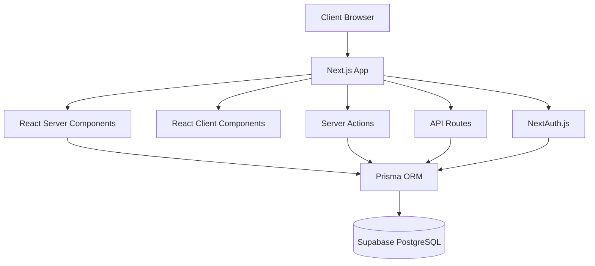
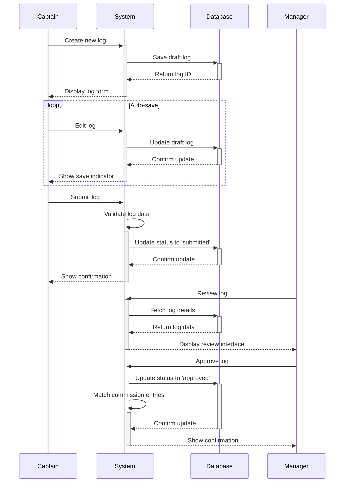
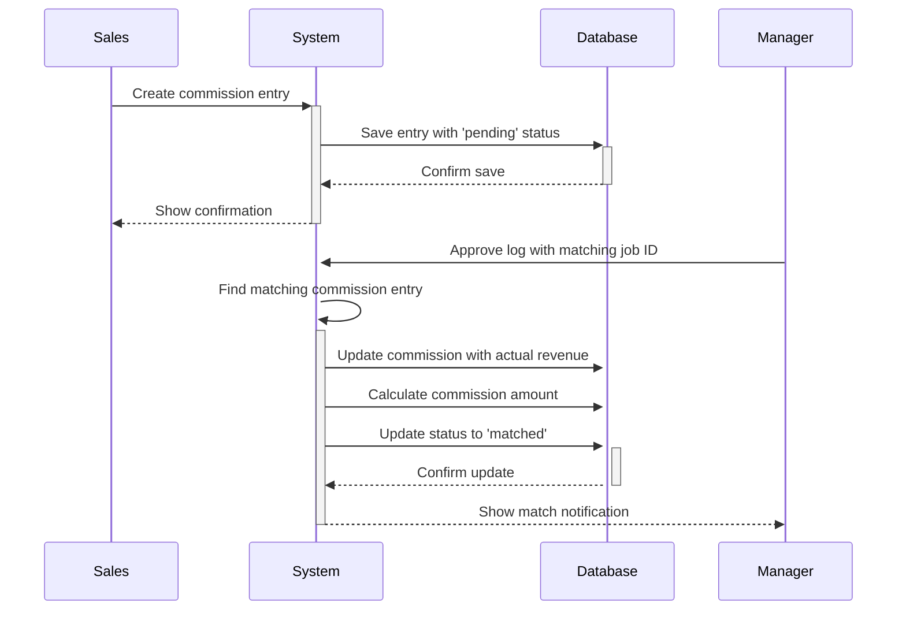
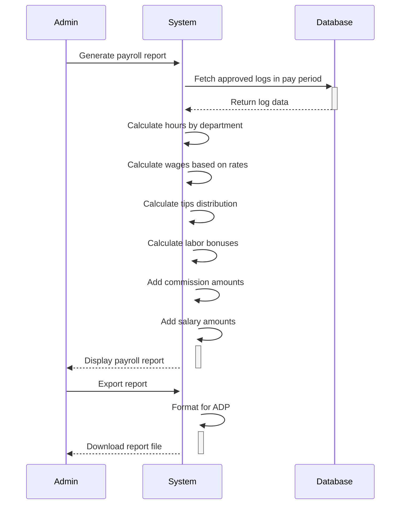

# Design Document

## Overview

HUNKCentral is a digital workforce management system designed to replace paper logs and Excel spreadsheets for College Hunks Hauling Junk & Moving. This document outlines the technical design and architecture for implementing the system based on the requirements document.

The system will be built as a modern web application using Next.js 15 with App Router, focusing on simplicity, performance, and mobile-first design. It will enable captains to submit daily work logs, managers to review and approve them, sales staff to track commissions, and administrators to generate payroll reports.

## Architecture

### Technical Stack

- **Framework**: Next.js 15 (App Router) with TypeScript
- **UI**: Shadcn/ui (New York theme) + Tailwind CSS
- **Database**: Supabase-hosted PostgreSQL (used with Prisma ORM, not Supabase Auth)
- **Forms**: React Hook Form + Zod
- **State**: Zustand (minimal, only where needed)
- **Authentication**: NextAuth.js with credentials provider and Prisma adapter
- **Deployment**: Vercel

### System Architecture

The application follows a modern Next.js architecture with:

1. **Server Components**: For initial page loads and data fetching
2. **Client Components**: For interactive UI elements
3. **Server Actions**: For form submissions and data mutations
4. **API Routes**: For authentication and specialized endpoints



### Deployment Architecture

The application will be deployed on Vercel with the following environments:

1. **Development**: Local development environment
2. **Preview**: Automatically deployed for pull requests
3. **Production**: Deployed from the main branch

## Components and Interfaces

### Core Application Structure

```
/app
  /auth                → Login + reset
  /(protected)
    /dashboard         → Role-based views
    /logs              → Create, review, detail
    /commission        → Entry, list, match
    /reports           → Payroll, bonuses
    /admin             → User + period mgmt

/components
  /ui                  → Shadcn components
  /UnifiedForm         → Forms powered by Zod + RHF
  /features
    /logs
    /commission
    /reports

/lib
  /auth.ts             → Session + role helpers
  /prisma.ts           → Prisma client
  /payCalculator.ts    → Bonus + labor %
  /commissionMatcher.ts
  /routes.ts
  /types.ts

/hooks
  /useSession
  /useLogs
  /useCommission
```

### Key Components

#### Authentication Components

- **LoginForm**: **Card** with **CardHeader**, **CardContent**, **CardFooter** layout, **Input** components with validation, **Button** with loading states.
- **ProtectedRoute**: HOC for role-based access control with **Alert** for unauthorized access
- **RoleGuard**: Component for conditional rendering based on multiple roles
- **UserProfile**: **Tabs** for different profile sections, **Card** layout for settings, **Avatar** with **DropdownMenu**
- **LogoutButton**: **Button** with confirmation **AlertDialog** and session cleanup
- **SessionTimeout**: **Dialog** component for session expiration warnings with countdown **Progress** indicator

#### Log Management Components

- **LogForm**: Multi-section form using **Tabs** for log sections (Junk, Move, Other Hours) with **Card** containers and **Separator** elements
- **CaptainSelector**: **Select** component with searchable dropdown for captain selection, defaults to current user
- **LogSectionSelector**: **Checkbox** group for dynamic section visibility selection
- **JobSection**: **Card** layout container for multiple job entries with **Collapsible** optional fields
- **JobTile**: **Card** with **CardHeader** and **CardContent**, includes **Button** with "Add Another Job" functionality
- **TeamHoursSection**: **Accordion** for employee hour entries with **Button** "Add HUNK" functionality
- **HunkEntry**: **Card** component with **Select** for employee/department and **Input** for hours, **Checkbox** for co-captain
- **SectionSummary**: **Card** with **Progress** bars for labor cost percentages, **Badge** for tips per HUNK, **HoverCard** for calculation explanations
- **LogTotals**: **Card** with comprehensive statistics, **Table** for employee summary, **Badge** clusters for status
- **LogReviewQueue**: **Table** with sortable columns, **Badge** for status, **Button** for bulk actions, **Input** for search
- **LogDetail**: **Resizable** panels for side-by-side comparison, **Tabs** for sections, **Popover** for inline editing

#### Commission Components

- **CommissionForm**: **Card** with clean form layout, **Select** for sales consultant, **Input** with validation, **Calendar** for dates
- **SalesConsultantSelector**: **Select** component with searchable dropdown, defaults to current user with sales role
- **CommissionList**: **Table** with status columns, **Badge** for commission status, **Progress** for booking accuracy, **HoverCard** for details
- **CommissionMatcher**: Service with **Toast** notifications for successful matches and **Alert** for conflicts

#### Report Components

- **PayrollReport**: **Tabs** for report types, **Table** with advanced sorting/filtering, **Card** summaries, **Chart** for analytics, **Progress** for generation
- **IndividualReport**: **Accordion** for expandable sections, **Card** for compensation breakdown, **Progress** for performance metrics, **Separator** for pay components
- **ReportExport**: **Button** with **Dialog** for export options, **Progress** indicator, **Toast** for completion feedback

#### Admin Components

- **UserForm**: **Dialog** for user creation/editing, **Tabs** for information sections, **Input** for compensation fields, **Checkbox** group for roles
- **PayPeriodManager**: **Card** grid for period overview, **Calendar** for dates, **Badge** for status, **AlertDialog** for confirmations

#### Audit Trail Components

- **AuditLogViewer**: **Table** with chronological activity display, **Badge** for action types, **HoverCard** for change details
- **AuditLogDetail**: **Card** with before/after comparison, **Tabs** for different change types, **Badge** for user identification
- **AuditLogFilter**: **Select** and **Input** components for filtering by date range, user, and entity type
- **ChangeHistory**: **Timeline** component showing sequential changes with **Separator** between entries

### UI Design

The application will use Shadcn/ui components with the New York theme, featuring a modern, clean aesthetic similar to contemporary Next.js applications. The design will be customized with College Hunks brand colors:

- **Primary**: `#026937` (College Hunks Green)
- **Secondary**: `#ea7200` (College Hunks Orange)
- **Theme Support**: Full light/dark mode toggle with system preference detection
- **Modern Styling**: Clean typography, subtle shadows, rounded corners, and smooth transitions

The UI will follow these design principles:

1. **Mobile-first**: Optimized for field use on phones
2. **Single-page forms**: No multi-step wizards
3. **Real-time validation**: Immediate feedback
4. **Auto-save**: Prevent data loss
5. **Minimal clicks**: Direct actions, no modals
6. **Modern Aesthetics**: Contemporary design patterns with polished interactions

### UI Implementation Strategy

#### 4-Phase Implementation Approach

1. **Phase 1 - Core Layout**: **NavigationMenu**, **Card** layouts, **Button** components, **Input**/**Select** foundations
2. **Phase 2 - Dynamic Features**: **Tabs**, **Collapsible**/**Accordion**, **Progress**/**Badge** feedback, **HoverCard**/**Tooltip** UX
3. **Phase 3 - Advanced Interactions**: **Table** with sorting/filtering, **Dialog**/**AlertDialog**, **Sheet**/**Drawer** mobile optimization
4. **Phase 4 - Polish & Performance**: **Toast** notifications, **Skeleton** loading states, **ContextMenu**, **Resizable** panels

#### Advanced UX Features

- **Motion & Feedback**: **HoverCard** for contextual info, **Popover** for quick actions, **Toast** for all user actions
- **Visual Polish**: **Progress** with smooth animations, **AspectRatio** for consistency, **Separator** for hierarchy
- **Smart Interactions**: **ContextMenu** for power users, **Collapsible** for space management, **ToggleGroup**/**RadioGroup** for selections
- **Rich Context**: **AlertDialog** for confirmations, **Accordion** for organized display, **Tooltip** for helpful hints

#### Theme System

- **Light Mode**: Clean white backgrounds with subtle gray accents
- **Dark Mode**: Dark backgrounds with appropriate contrast ratios
- **System Detection**: Automatically detects user's system preference
- **Toggle Control**: Easy theme switching via user interface
- **Persistence**: Theme preference saved to user profile

#### Navigation & Layout

- **Mobile**: **NavigationMenu** adapted for touch with **Sheet** slide-out navigation and **Drawer** for bottom-up interactions
- **Desktop**: **Collapsible** sidebar with **NavigationMenu** dropdowns, **Breadcrumb** context navigation
- **Header**: **NavigationMenu** with role-based dropdowns, **Avatar** + **DropdownMenu** for user profile, theme toggle
- **User Menu**: **DropdownMenu** with **Separator** sections for profile, settings, theme toggle, and logout
- **Responsive**: **Sheet** replaces sidebar on mobile, **NavigationMenu** adapts to screen size seamlessly

#### Form Design

- Large touch targets (minimum 44px)
- Appropriate keyboard types for input fields
- Clear visual feedback with modern focus states
- Inline validation with smooth animations
- Modern input styling with floating labels where appropriate

## Data Models

### Database Schema

```prisma
// Users (NextAuth + Prisma)
model User {
  id                String    @id @default(uuid())
  email             String    @unique
  password          String
  fullName          String
  roles             String[]  // Array of roles: 'captain', 'wingman', 'manager', 'sales', 'admin'

  // Department-specific hourly rates
  rateJunkCaptain   Decimal?  @db.Decimal(6, 2)
  rateJunkWingman   Decimal?  @db.Decimal(6, 2)
  rateMoveCaptain   Decimal?  @db.Decimal(6, 2)
  rateMoveWingman   Decimal?  @db.Decimal(6, 2)
  rateZigma         Decimal?  @db.Decimal(6, 2)
  rateTraining      Decimal?  @db.Decimal(6, 2)
  rateEstimating    Decimal?  @db.Decimal(6, 2)
  rateWarehouse     Decimal?  @db.Decimal(6, 2)
  rateAdmin         Decimal?  @db.Decimal(6, 2)

  // Salary settings
  salaryAmount      Decimal?  @db.Decimal(10, 2)
  salaryFrequency   String?   // 'weekly', 'bi-weekly', 'monthly'
  salaryType        String?   // 'base': replaces hourly wages, 'guaranteed': minimum if primary pay is low, 'supplemental': added to other earnings

  // Commission and bonus settings
  commissionRate    Decimal?  @db.Decimal(5, 2)
  junkBonusGoal     Decimal   @default(0.14) @db.Decimal(5, 2)
  moveBonusGoal     Decimal   @default(0.24) @db.Decimal(5, 2)

  createdAt         DateTime  @default(now())
  updatedAt         DateTime  @updatedAt

  // Relations
  dailyLogs         DailyLog[]
  approvedLogs      DailyLog[] @relation("ApprovedBy")
  createdLogs       DailyLog[] @relation("CreatedBy")
  editedLogs        DailyLog[] @relation("LastEditedBy")
  logHours          LogHour[]
  commissionEntries CommissionEntry[]
  auditLogs         AuditLog[]
}

// Daily Logs
model DailyLog {
  id          String    @id @default(uuid())
  captainId   String
  captain     User      @relation(fields: [captainId], references: [id])
  logDate     DateTime  @db.Date
  status      String    // 'draft', 'submitted', 'approved'
  submittedAt DateTime?
  approvedAt  DateTime?
  approvedById String?
  approvedBy  User?     @relation("ApprovedBy", fields: [approvedById], references: [id])

  // Audit fields
  createdById String
  createdBy   User      @relation("CreatedBy", fields: [createdById], references: [id])
  lastEditedById String?
  lastEditedBy User?    @relation("LastEditedBy", fields: [lastEditedById], references: [id])

  createdAt   DateTime  @default(now())
  updatedAt   DateTime  @updatedAt

  // Relations
  jobs        LogJob[]
  hours       LogHour[]
  commissions CommissionEntry[]
  auditLogs   AuditLog[]
}

// Log Jobs
model LogJob {
  id          String   @id @default(uuid())
  logId       String
  log         DailyLog @relation(fields: [logId], references: [id])
  jobType     String   // 'junk', 'move'
  jobId       String
  clientName  String
  revenue     Decimal  @db.Decimal(10, 2)
  tips        Decimal  @db.Decimal(10, 2)

  // Move-specific fields
  junkOnMove  Decimal? @db.Decimal(10, 2)
  valuation   Decimal? @db.Decimal(10, 2)
  materials   Decimal? @db.Decimal(10, 2)

  // Junk-specific fields (section level)
  disposalCost Decimal? @db.Decimal(10, 2)

  createdAt   DateTime @default(now())
  updatedAt   DateTime @updatedAt
}

// Log Hours
model LogHour {
  id          String   @id @default(uuid())
  logId       String
  log         DailyLog @relation(fields: [logId], references: [id])
  employeeId  String
  employee    User     @relation(fields: [employeeId], references: [id])
  department  String   // 'junk', 'move', 'zigma', 'training', 'estimating', 'warehouse', 'admin'
  hours       Decimal  @db.Decimal(5, 2)
  isCoCaptain Boolean  @default(false)

  createdAt   DateTime @default(now())
  updatedAt   DateTime @updatedAt
}

// Commission Entries
model CommissionEntry {
  id               String    @id @default(uuid())
  salesId          String
  sales            User      @relation(fields: [salesId], references: [id])
  jobId            String    @unique
  clientName       String
  jobType          String
  targetDate       DateTime  @db.Date
  estimatedRevenue Decimal   @db.Decimal(10, 2)
  actualRevenue    Decimal?  @db.Decimal(10, 2)
  commissionAmount Decimal?  @db.Decimal(10, 2)
  status           String    // 'pending', 'matched', 'approved'

  matchedLogId     String?
  matchedLog       DailyLog? @relation(fields: [matchedLogId], references: [id])

  createdAt        DateTime  @default(now())
  updatedAt        DateTime  @updatedAt
}

// Pay Periods
model PayPeriod {
  id        String   @id @default(uuid())
  name      String
  startDate DateTime @db.Date
  endDate   DateTime @db.Date
  status    String   // 'open', 'locked', 'closed'

  createdAt DateTime @default(now())
  updatedAt DateTime @updatedAt
}

// Audit Log
model AuditLog {
  id          String   @id @default(uuid())
  entityType  String   // 'daily_log', 'commission_entry', 'user', etc.
  entityId    String   // ID of the entity being audited
  action      String   // 'create', 'update', 'delete', 'approve', 'submit'
  changes     Json?    // JSON object containing before/after values
  userId      String
  user        User     @relation(fields: [userId], references: [id])

  // Optional relation to daily log for log-specific audits
  dailyLogId  String?
  dailyLog    DailyLog? @relation(fields: [dailyLogId], references: [id])

  createdAt   DateTime @default(now())
}
```

### Data Flow

#### Captain Log Flow



#### Commission Flow



#### Payroll Report Flow



## Business Rules and Validation

### Salary Types

- **Base Salary**: Replaces hourly wages entirely - employee receives salary instead of hourly pay
- **Guaranteed Salary**: Minimum weekly/monthly guarantee - employee receives whichever is higher between calculated earnings (hourly/tips/commission) OR the guaranteed amount
- **Supplemental Salary**: Added on top of other earnings - employee receives hourly/tips/commission PLUS this additional amount

### Data Validation Rules

- **Tips**: Cannot be negative (minimum $0.00)
- **Revenue**: Minimum $1.00, maximum $10,000,000.00
- **Hours**: Maximum 24 hours per employee per day (effectively unlimited)
- **Disposal Costs**: Single field per Junk section covering all jobs in that section
- **Job IDs**: Must be unique across commission entries to prevent duplicates

### Calculation Rules

- **Labor Cost %**: (Total labor cost ÷ Total revenue) × 100
- **Tips per HUNK**: Total section tips ÷ Number of employees in section
- **Disposal Cost %**: (Disposal cost ÷ Junk section revenue) × 100
- **Upsell %**: (Total upsells ÷ Move section revenue) × 100
- **Bonus Goals**: Junk 14%, Move 24% labor cost targets

## Error Handling

### Form Validation

The application will use Zod schemas for form validation with React Hook Form:

```typescript
// Example Zod schema for log job
const logJobSchema = z.object({
  jobType: z.enum(['junk', 'move']),
  jobId: z.string().min(1, 'Job ID is required'),
  clientName: z.string().min(1, 'Client name is required'),
  revenue: z.number().min(0, 'Revenue must be a positive number'),
  tips: z.number().min(0, 'Tips must be a positive number'),
  // Conditional fields based on job type
  disposalCost: z.number().min(0).optional(),
  junkOnMove: z.number().min(0).optional(),
  valuation: z.number().min(0).optional(),
  materials: z.number().min(0).optional(),
});
```

### Error States

The application will handle the following error states:

1. **Validation Errors**: Displayed inline with form fields
2. **Network Errors**: Toast notifications with retry options
3. **Authentication Errors**: Redirect to login with error message
4. **Authorization Errors**: Display access denied message
5. **Server Errors**: User-friendly error page with error ID

### Error Logging

Errors will be logged to the server console and optionally to an error tracking service like Sentry.

## Testing Strategy

### Unit Testing

Unit tests will focus on critical business logic:

1. **Pay Calculation**: Test hourly rate application, tip distribution, and bonus calculations
2. **Commission Matching**: Test job ID matching and commission calculation
3. **Authentication**: Test role-based access control

### Integration Testing

Integration tests will cover key workflows:

1. **Log Submission Flow**: Create, submit, and approve a log
2. **Commission Matching Flow**: Create commission entry, approve matching log, verify commission calculation
3. **Payroll Report Generation**: Generate report for a pay period with various compensation types

### End-to-End Testing

E2E tests will cover critical user journeys:

1. **Captain Journey**: Login, create log, add jobs and hours, submit
2. **Manager Journey**: Login, review logs, approve logs
3. **Admin Journey**: Login, manage users, generate payroll reports

### Testing Tools

- **Unit Testing**: Jest
- **Integration Testing**: Jest with Prisma mocks
- **E2E Testing**: Playwright

## Performance Considerations

### Optimization Strategies

1. **Server Components**: Use React Server Components for data-heavy pages
2. **Image Optimization**: Use Next.js Image component for optimized images
3. **Code Splitting**: Automatic code splitting with Next.js
4. **Caching**: Use SWR for client-side data fetching with caching
5. **Pagination**: Implement pagination for large data sets
6. **Lazy Loading**: Lazy load components and data below the fold

### Performance Targets

- **Page Load Time**: < 1 second
- **Time to Interactive**: < 2 seconds
- **Lighthouse Score**: > 90 for all categories
- **First Input Delay**: < 100ms

## Security Considerations

### Authentication

- **Credentials Provider**: Email/password authentication with NextAuth.js
- **Session Management**: Server-side sessions with secure cookies
- **Password Storage**: Bcrypt hashing with appropriate cost factor
- **Biometric Support**: Optional biometric login on supported devices

### Authorization

- **Role-Based Access Control**: Five roles with different permissions
- **Row-Level Security**: Database policies to restrict data access
- **API Protection**: Server-side validation of all requests

### Data Protection

- **HTTPS**: Enforce HTTPS for all connections
- **Data Encryption**: Encrypt sensitive data at rest
- **Input Validation**: Validate all user input server-side
- **CSRF Protection**: Built-in CSRF protection with Next.js
- **Password Requirements**: Minimum 8 characters (letters/numbers)
- **Session Timeout**: 24 hours for inactive sessions

## Implementation Plan

The implementation will follow a phased approach:

### Phase 1: Foundation

- Set up Next.js project with Shadcn/ui
- Configure Supabase and Prisma
- Implement authentication with NextAuth
- Create basic layouts and navigation

### Phase 2: Core Features

- Implement captain log creation
- Build manager review interface
- Develop basic approval workflow
- Implement real-time calculations

### Phase 3: Commission & Reports

- Build commission entry system
- Implement auto-matching logic
- Create payroll report generation
- Develop employee self-service view

### Phase 4: Polish & Deploy

- Optimize for mobile
- Implement performance improvements
- Conduct user acceptance testing
- Deploy to production

## Conclusion

This design document outlines the technical approach for implementing the HUNKCentral workforce management system. The design focuses on simplicity, performance, and mobile-first user experience while meeting all the requirements specified in the requirements document.

The system will be built using modern web technologies and follow best practices for security, performance, and user experience. The phased implementation approach will allow for incremental development and testing of the system's core features.
