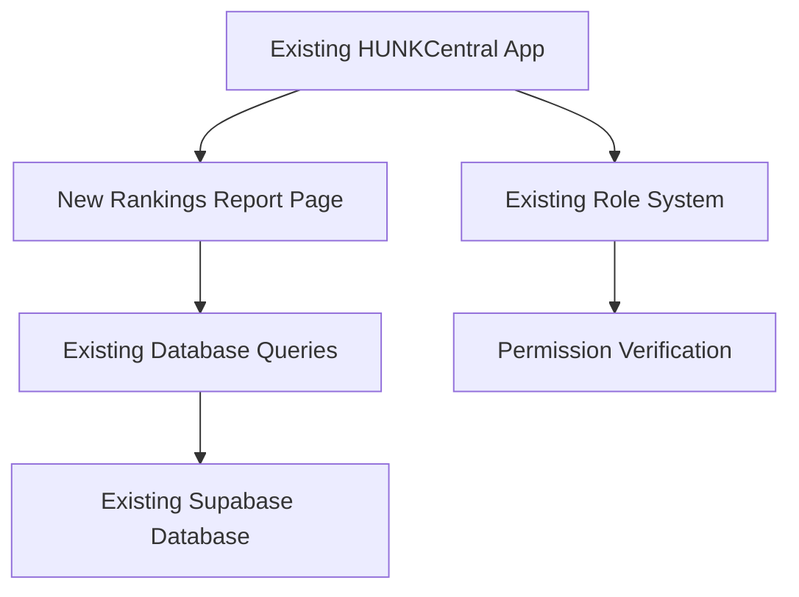

# Design Document

## Overview

This feature adds a new Rankings Report page to the existing HUNKCentral application and verifies that existing role-based permissions work correctly for the new functionality. The rankings report will display captain performance metrics without exposing payroll data, accessible to all authenticated users. We'll also verify that managers have appropriate access to their team members and wingmen can access their payroll information.

## Architecture

### Simple Addition to Existing System



The implementation leverages all existing infrastructure:

- Existing authentication and role system
- Current database schema and Prisma setup
- Established UI components and styling
- Current API patterns and middleware

## Components and Interfaces

### New Rankings Report Page

- **Location**: `/app/(protected)/reports/rankings/page.tsx`
- **Purpose**: Display captain performance metrics accessible to all users
- **Components**: Uses existing Card, Table, Badge, and Chart components
- **Data**: Aggregates existing log and job data without exposing payroll information

### Performance Metrics Display

- **Captain Performance Cards**: Show job count, average job size, total revenue, labor percentage
- **Junk vs Move Split**: Separate metrics for each operation type
- **Move-Specific Metrics**: Upsell, valuation, junk on move, materials percentages
- **Disposal Percentages**: Visual representation of disposal performance

### Role Permission Verification

- **Manager Access**: Verify managers can see captain/wingman data but not other roles
- **Wingman Payroll**: Confirm wingmen can access their payroll and tips information
- **Universal Rankings**: Ensure all authenticated users can view rankings report

## Data Sources

### Existing Database Tables

- **DailyLog**: Source for job count, revenue, and labor percentage data
- **LogJob**: Individual job details for performance calculations
- **LogHour**: Employee hours for labor percentage calculations
- **User**: Captain and employee information with roles
- **CommissionEntry**: Move-specific revenue data (upsell, valuation, etc.)

### Performance Calculations

- **Job Count**: Count of jobs per captain from LogJob table
- **Average Job Size**: Total revenue divided by job count
- **Labor Percentage**: Calculated using existing payroll calculation logic
- **Disposal Percentage**: Calculated from job disposal data
- **Move Metrics**: Derived from existing commission and job data

### TypeScript Interfaces (additions to existing types)

```typescript
interface CaptainPerformanceData {
  captainId: string;
  captainName: string;
  junkMetrics: {
    jobCount: number;
    totalRevenue: number;
    averageJobSize: number;
    laborPercentage: number;
    disposalPercentage: number;
  };
  moveMetrics: {
    jobCount: number;
    totalRevenue: number;
    averageJobSize: number;
    laborPercentage: number;
    upsellRevenue: number;
    upsellPercentage: number;
    valuationRevenue: number;
    valuationPercentage: number;
    junkOnMoveRevenue: number;
    junkOnMovePercentage: number;
    materialsRevenue: number;
    materialsPercentage: number;
  };
}
```

## Implementation Approach

### Leverage Existing Infrastructure

- Use existing Shadcn/UI components and styling
- Follow established API patterns and middleware
- Utilize current authentication and role system
- Build on existing database queries and calculations

### Simple Additions Required

1. **New Rankings Page**: Single page component using existing UI patterns
2. **Performance Calculations**: Extend existing payroll calculation logic
3. **Role Verification**: Test and confirm existing permissions work correctly
4. **API Endpoint**: One new endpoint for rankings data using existing patterns

### Testing Strategy

- Unit tests for performance calculations using existing test patterns
- Integration tests for role permissions using current test infrastructure
- Component tests for rankings page using established testing approach

This is a straightforward addition to the existing system rather than a complex new feature set.
