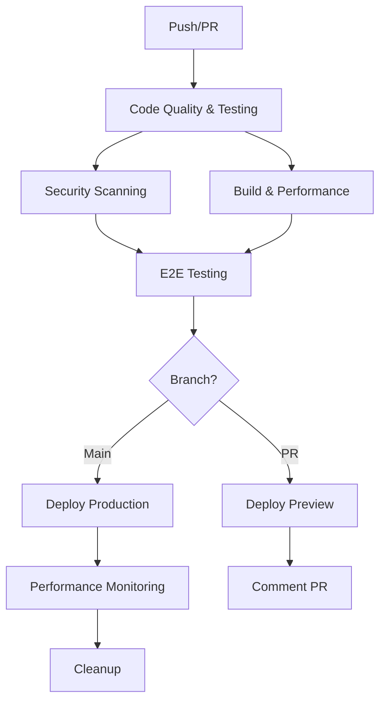

# CI/CD Deployment Guide for HUNKCentral

This guide provides step-by-step instructions for setting up and using the HUNKCentral CI/CD pipeline.

## Overview

Our CI/CD pipeline provides:

- **Automated Testing**: Unit tests, integration tests, and E2E tests
- **Code Quality Checks**: ESLint, TypeScript, and Prettier
- **Security Scanning**: Dependency vulnerabilities and code analysis
- **Automated Deployment**: Preview deployments for PRs, production deployments for main branch
- **Performance Monitoring**: Bundle analysis and Lighthouse CI
- **Comprehensive Reporting**: Coverage reports and deployment status

## Pipeline Architecture



## Workflow Files

### 1. Main CI/CD Pipeline (`.github/workflows/ci-cd.yml`)

**Comprehensive pipeline with all checks and deployments**

- **Triggers**: Push to main/develop/feature branches, PRs to main/develop
- **Jobs**: Quality checks, security scanning, build, E2E tests, deployments
- **Features**: Full test suite, security scans, performance monitoring

### 2. Basic CI (`.github/workflows/ci.yml`)

**Lightweight pipeline for quick feedback**

- **Triggers**: All pushes and PRs
- **Jobs**: Code quality, basic tests, build verification
- **Features**: Fast feedback loop, essential checks only

### 3. Vercel Deployment (`.github/workflows/vercel-deployment.yml`)

**Dedicated deployment pipeline**

- **Triggers**: Push to main/develop, PRs to main
- **Jobs**: Test and deploy to Vercel
- **Features**: Environment-specific deployments

### 4. Dependency Updates (`.github/workflows/dependency-update.yml`)

**Automated dependency management**

- **Triggers**: Scheduled (weekly)
- **Jobs**: Update dependencies, run tests, create PR
- **Features**: Automated security updates

## Setup Instructions

### Step 1: Configure GitHub Secrets

Set up the following secrets in your GitHub repository:

```bash
# Vercel Deployment
VERCEL_TOKEN=your-vercel-token
VERCEL_ORG_ID=your-vercel-org-id
VERCEL_PROJECT_ID=your-vercel-project-id

# Code Quality & Security
CODECOV_TOKEN=your-codecov-token
SNYK_TOKEN=your-snyk-token
LHCI_GITHUB_APP_TOKEN=your-lighthouse-ci-token
```

See [GitHub Secrets Documentation](./github-secrets.md) for detailed instructions.

### Step 2: Configure Vercel Environment Variables

Set up environment variables in your Vercel dashboard:

**Production Environment:**

```bash
DATABASE_URL=your-production-database-url
NEXTAUTH_URL=https://your-domain.com
NEXTAUTH_SECRET=your-production-secret
NEXT_PUBLIC_SUPABASE_URL=your-production-supabase-url
NEXT_PUBLIC_SUPABASE_ANON_KEY=your-production-anon-key
SUPABASE_SERVICE_ROLE_KEY=your-production-service-key
```

**Preview Environment:**

```bash
DATABASE_URL=your-preview-database-url
NEXTAUTH_URL=https://your-preview-domain.vercel.app
NEXTAUTH_SECRET=your-preview-secret
NEXT_PUBLIC_SUPABASE_URL=your-preview-supabase-url
NEXT_PUBLIC_SUPABASE_ANON_KEY=your-preview-anon-key
SUPABASE_SERVICE_ROLE_KEY=your-preview-service-key
```

### Step 3: Test the Pipeline

1. **Create a test branch:**

   ```bash
   git checkout -b test-ci-cd-pipeline
   git push origin test-ci-cd-pipeline
   ```

2. **Create a pull request** to trigger the preview deployment

3. **Verify all checks pass** in the GitHub Actions tab

4. **Check the preview deployment** link in the PR comment

### Step 4: Configure Branch Protection

Set up branch protection rules for the `main` branch:

1. Go to **Settings** → **Branches**
2. Add rule for `main` branch
3. Enable:
   - Require status checks to pass
   - Require branches to be up to date
   - Include administrators
   - Restrict pushes that create files

## Usage Guide

### Development Workflow

1. **Create feature branch:**

   ```bash
   git checkout -b feature/your-feature-name
   ```

2. **Make changes and commit:**

   ```bash
   git add .
   git commit -m "feat: add new feature"
   git push origin feature/your-feature-name
   ```

3. **Create pull request** - this triggers:
   - Code quality checks
   - Security scanning
   - Test suite
   - Preview deployment

4. **Review and merge** - merging to main triggers:
   - Full test suite
   - Production deployment
   - Performance monitoring

### Manual Deployments

**Deploy to preview:**

```bash
npm run deploy:preview
```

**Deploy to production:**

```bash
npm run deploy:production
```

### Local Testing

**Run all checks locally:**

```bash
# Code quality
npm run lint
npm run type-check

# Tests
npm run test
npm run test:coverage
npm run test:e2e

# Build
npm run build
```

**Check CI/CD setup:**

```bash
node scripts/check-ci-cd-setup.js
```

## Monitoring and Alerts

### GitHub Actions Monitoring

- **Failed workflows**: Automatic email notifications
- **Status badges**: Add to README for visibility
- **Workflow insights**: Monitor performance and success rates

### Vercel Monitoring

- **Deployment status**: Real-time deployment monitoring
- **Performance metrics**: Core Web Vitals tracking
- **Error tracking**: Automatic error reporting

### Third-party Integrations

- **Codecov**: Code coverage tracking and reports
- **Snyk**: Security vulnerability monitoring
- **Lighthouse CI**: Performance regression detection

## Troubleshooting

### Common Issues

1. **Build failures:**

   ```bash
   # Check locally first
   npm run build
   npm run type-check
   npm run lint
   ```

2. **Test failures:**

   ```bash
   # Run tests locally
   npm run test
   npm run test:e2e
   ```

3. **Deployment failures:**
   - Check Vercel environment variables
   - Verify GitHub secrets are set
   - Check database connectivity

4. **Security scan failures:**
   ```bash
   # Update dependencies
   npm audit fix
   npm update
   ```

### Debug Commands

```bash
# Check workflow status
gh workflow list
gh run list

# View workflow logs
gh run view [run-id]

# Check Vercel deployments
vercel ls
vercel logs [deployment-url]
```

## Performance Optimization

### Bundle Analysis

The pipeline automatically analyzes bundle size:

```bash
# Local bundle analysis
npm run analyze
```

### Lighthouse CI

Performance monitoring runs automatically on production deployments:

- **Performance score**: Must be > 90
- **Accessibility score**: Must be > 95
- **Best practices**: Must be > 90
- **SEO score**: Must be > 90

### Caching Strategy

- **Static assets**: Cached at CDN level
- **API responses**: Cached with appropriate headers
- **Database queries**: Optimized with indexes and connection pooling

## Security Considerations

### Automated Security Checks

- **Dependency scanning**: Snyk integration
- **Code analysis**: CodeQL integration
- **Secret detection**: GitHub secret scanning
- **License compliance**: Automated license checking

### Security Headers

Configured in `next.config.js`:

- X-Frame-Options: DENY
- X-Content-Type-Options: nosniff
- Referrer-Policy: strict-origin-when-cross-origin
- Permissions-Policy: camera=(), microphone=(), geolocation=()

## Maintenance

### Regular Tasks

- **Weekly**: Review dependency updates
- **Monthly**: Rotate secrets and tokens
- **Quarterly**: Security audit and penetration testing
- **Annually**: Review and update CI/CD pipeline

### Monitoring Checklist

- [ ] All workflows passing
- [ ] No security vulnerabilities
- [ ] Performance metrics within targets
- [ ] Error rates below thresholds
- [ ] Deployment success rate > 95%

## Support

For CI/CD pipeline issues:

1. **Check the troubleshooting section** above
2. **Review workflow logs** in GitHub Actions
3. **Contact the DevOps team** for complex issues
4. **Create an issue** in the repository for bugs

---

**Last Updated**: December 2024
**Pipeline Version**: 2.0
**Maintained by**: DevOps Team
